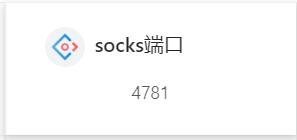
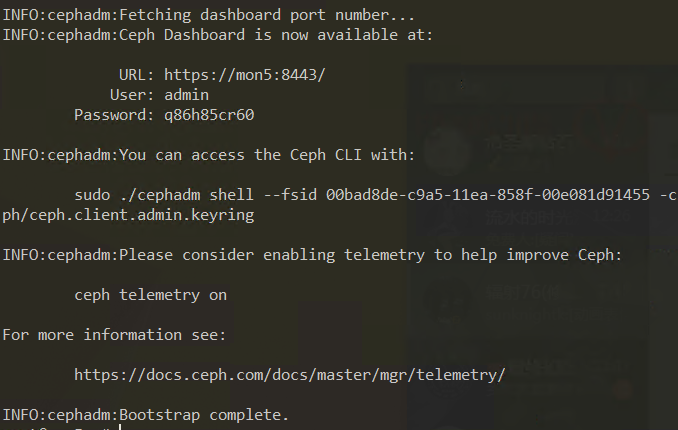
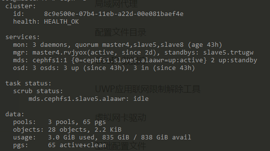

# Ubuntu 18.04 LTS 64位机上使用cephadm部署ceph集群		

## 1.为便于标识，*所有节点配置*，并进行节点规划。

节点规划如图所示

​	

| hostname |              character              |
| :------: | :---------------------------------: |
|  host1   | cephadm,monitor,mgr,rgw,mds,osd,nfs |
|  host2   |     monitor,mgr,rgw,mds,osd,nfs     |
|  host3   |     monitor,mgr,rgw,mds,osd,nfs     |

关闭防火墙

```
ufw disable
```

升级系统

```
apt-get update

apt-get upgrade
```

时间同步

```
apt-get install ntp

timedatectl set-ntp false
```

修改/etc/ntp.conf

在一堆pool的地方把pool注释掉，加入

```bash
server 0.asia.pool.ntp.org
server 1.1.cn.pool.ntp.org
```

重启或重载服务

```
service ntp restart
```

查看ntp状态

```
ntpq -p
```

安装lvm2

```
apt install lvm2
```

修改hosts并推送到所有节点

```
127.0.0.1       localhost
127.0.1.1       localhost

192.168.1.2  host1
192.168.1.3  host2
192.168.1.4  host3
```

```
scp /etc/hosts root@192.168.1.3:/etc/hosts
scp /etc/hosts root@192.168.1.4:/etc/hosts
```

安装python

apt-get install python3

如果自带的python版本低于最新而又想更新，加入版本号并切换

#### **WARNING：如果系统自带python3，不建议在这时候切换新的python3版本，原因后面会说**

```
apt-get install python3.7
update-alternatives --install /usr/bin/python3 python3 /usr/bin/python3.6 1
update-alternatives --install /usr/bin/python3 python3 /usr/bin/python3.7 2
update-alternatives --config python3
2
```

### 安装docker

cephadm基于容器运行所有ceph组件，所有节点需要安装docker或podman，以下以安装docker为例。

ubuntu安装docker引擎的官方文档https://docs.docker.com/engine/install/ubuntu/

请先在上面的地址中查看当前的ubuntu支持版本。当前（2020.7）的支持版本为：

- Ubuntu Focal 20.04 (LTS)
- Ubuntu Eoan 19.10
- Ubuntu Bionic 18.04 (LTS)
- Ubuntu Xenial 16.04 (LTS)


首先，卸载系统中自带的旧版本docker。

```
sudo apt-get remove docker docker-engine docker.io containerd runc
```

更新apt老两件

```
sudo apt-get update
sudo apt-get upgrade
```

安装软件包，以使得apt可以通过HTTPS使用仓库。

```
apt-get install \
    apt-transport-https \
    ca-certificates \
    curl \
    gnupg-agent \
    software-properties-common
```

添加docker官方gpg秘钥

```
curl -fsSL https://download.docker.com/linux/ubuntu/gpg | sudo apt-key add -
```

验证

```
sudo apt-key fingerprint 0EBFCD88

pub   rsa4096 2017-02-22 [SCEA]
      9DC8 5822 9FC7 DD38 854A  E2D8 8D81 803C 0EBF CD88
uid           [ unknown] Docker Release (CE deb) <docker@docker.com>
sub   rsa4096 2017-02-22 [S]
```

设置稳定的仓库

```
sudo add-apt-repository \
   "deb [arch=amd64] https://download.docker.com/linux/ubuntu \
   $(lsb_release -cs) \
   stable"
```

安装docker

```
sudo apt-get install docker-ce docker-ce-cli containerd.io
```

#### **WARNING：这将会安装当前最新版本的docker，如果你要安装指定版本，可以使用下列命令**

```
apt-cache madison docker-ce   //将会输出可选版本
sudo apt-get install docker-ce=<VERSION_STRING> docker-ce-cli=<VERSION_STRING> containerd.io
```

运行helloworld测试安装成果

```
sudo docker run hello-world
```


#### ERROR:在设置仓库那一步如果报错“No module named 'apt_pkg'”的处理办法

出现这种情况一般都是由于上文所说的切换了python3版本导致的，安装使用的add-apt-repository脚本需要特定python版本运行，使用下列命令

```
ls /usr/lib/python3/dist-packages/apt_pkg*
```


我的输出是

```
/usr/lib/python3/dist-packages/apt_pkg.cpython-36m-x86_64-linux-gnu.so
/usr/lib/python3/dist-packages/apt_pkg.pyi
```

可以看出，我的脚本支持的版本是python3.6（图中的36m），于是将python3版本切换为python3.6

```
sudo rm /usr/bin/python3

sudo ln -s /usr/bin/python3.x /usr/bin/python3
```

替换为你的python版本，在运行脚本，即可设置成功。

#### **WARNING:代理及镜像设置办法**

在docker安装和拉取镜像操作中频繁遇到被墙的情况，这里附上代理设置。

首先要有科学上网工具，查看代理的端口号（sock5,sock4或http等）



curl命令使用代理：

```
curl --sock5 127.0.0.1:7891
```

推荐：使用proxychains4工具

安装：

```
apt-get install proxychains4

vim /etc/proxychains4.conf
```

将最底下sock4=xxxx改为sock5/http=xxxx:xxxx(your ip:port)

使用时在命令前加上proxychains4即可，如：

```
proxychains4 wget www.google.com
```

代理一般只适用于小文件传输或连接，因为它毕竟不够稳定，带宽一般也受限，如果用来下载一些较大的docker镜像肯定会捉襟见肘。因此推荐切换docker镜像源。

创建文件

```
vim /etc/docker/daemon.json
```

在其中添加

```
{
        "registry-mirrors":[
                "https://registry.docker-cn.com",
                "https://gpnmcpog.mirror.aliyuncs.com"]
}
```

重载

```
sudo systemctl daemon-reload
sudo systemctl restart docker
```


## 2.安装cephadm，*仅需在mon节点操作*

### 1.下载安装cephadm

在github上下载，注意需要代理。

```shell
curl https://raw.githubusercontent.com/ceph/ceph/v15.2.1/src/cephadm/cephadm -o cephadm
chmod +x cephadm
```

添加仓库、更新索引并安装

```
./cephadm add-repo --release octopus
apt update
./cephadm install
```

#### **ERROR:update时出现未注册错误**

错误可能如下：

```
Err:5 https://download.ceph.com/debian-octopus bionic InRelease
  The following signatures couldn't be verified because the public key is not available: NO_PUBKEY E84AC2C0460F3994
E: The repository 'https://download.ceph.com/debian-octopus bionic InRelease' is not signed.
```

需要信任注册key

```
sudo gpg --keyserver keyserver.ubuntu.com --recv E84AC2C0460F3994

sudo gpg --export --armor E84AC2C0460F3994 | sudo apt-key add -
```

上面的key改为你自己的提示中的key，然后update就可以了。

### 2.引导mon作为集群的开始

```
cephadm bootstrap --mon-ip 127.0.0.1
```

ip换为host1的ip。

### **TIPS:其实即便不安装cephadm，也可以直接从脚本运行cephadm命令**

```shell
./cephadm bootstrap --mon-ip 127.0.0.1
```

或者添加别名。

```
alias ceph='。/cephadm shell -- ceph'
```

这样，我们可以直接使用ceph来使用ceph shell。

完成后如图所示。



图中显示了dashboard的查看方法，记住并尝试查看（第一次登陆会强制让你重置密码）。

#### WARING：如果重复初始化集群，会在/var/lib/ceph下生成多个实例文件夹，使得ceph shell运行时报错：

```
Cannot infer an fsid, one must be specified:****
```

只要在ceph目录下删掉多余的只保留一个就行。

### 3.添加其他节点

将ssh秘钥送到其他节点

```
ssh-copy-id -f -i /etc/ceph/ceph.pub root@host2
ssh-copy-id -f -i /etc/ceph/ceph.pub root@host3
```

告诉ceph新节点是谁

```
ceph orch host add host2
ceph orch host add host3
```

报错一般是由于ssh秘钥问题或者ip和hosts不匹配，请仔细检查。

### 4.添加osd

使用命令查看都有哪些设备可用，注意：只会列出安装了mon的节点的设备。

```
ceph orch device ls
```

会显示设备情况及是否可用。

cephadm当前版本下的待选设备必须具有以下条件才能做成osd：

- 设备必须没有分区。
- 设备不得具有任何LVM状态。
- 不得安装设备。
- 该设备不得包含文件系统。
- 该设备不得包含Ceph BlueStore OSD。
- 设备必须大于5 GB。

简单来说就是必须是一块干净的物理硬盘，不能是lvm卷。使用以下命令可以在所有可用的设备上安装osd：

```shell
ceph orch apply osd --all-available-devices
```

当然，这也只会在安装了mon的节点上安装osd，要创建osd到其他节点，需要使用指定命令：

```shell
ceph orch daemon add osd node1:/dev/sdb
```

命令的最后部分为节点:设备路径，根据自己情况修改。

当使用此种方法扩展osd到一个什么都没有部署的节点时，系统会在无响应的状态下卡很久，这是因为其会先在节点上创建mon、mgr等后才会创建osd，耐心等待。部署完成后，系统可能会以抛出一个RunningtimeException来结束命令，不用怕，使用状态命令查询一下集群信息。

```
ceph -s
```




可以看到osd其实是添加成功了的。

如果发现添加失败，一般是由于ssh的通信问题，请自行查看解决方法。

### 5.添加mds

使用cephfs将会必须用到mds守护程序，然而现在cephadm在创建cephfs卷时将会自动完成mds的创建，因此本步骤可跳过。

标准创建语句如下

```
ceph orch apply mds *<fs-name>* --placement="*<num-daemons>* [*<host1>* ...]"
```

如：

```shell
ceph orch apply mds cephfs_name --placement="3 node1 node2 node3"
```