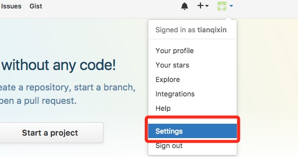
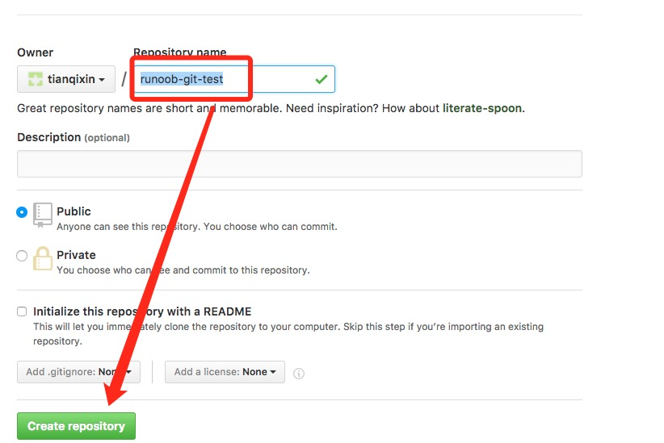

# windows下配置github与git，使得笔记或代码实现云同步（如typora）

本文将以笔记为例，主要记述建立本地仓库与github远程仓库，并实现同步的过程。

## 1.注册github，并与本机建立ssh链接

注册过程百度，使用邮箱注册成功后，在本机设置github登录信息

```
git config --global user.name "your_name"
git config --global user.email "your_email@example.com"
```

在本机上生成ssh秘钥，命令中换成你注册的邮箱，过程中一路回车就好。

```
ssh-keygen -t rsa -C "youremail@example.com"
```

成功后，在home目录（C:\Users\xxx）下查看.ssh文件夹，应该会有生成的id_rsa和id_rsa.pub，很明显一个是私钥一个是公钥，打开公钥id_rsa.pub,复制里面的公钥。

打开github，打开**account** -- **setting**



左边选择 **SSH and GPG keys**，然后点击 **New SSH key** 按钮,title 设置标题，可以随便填，粘贴在你电脑上生成的 key。


完成后如下图所示。


输入以下命令测试是否连接成功。

```
$ ssh -T git@github.com
Hi tianqixin! You've successfully authenticated, but GitHub does not provide shell access.
```


## 2.建立本地仓库与远程仓库

在本地建立仓库很简单，在想要建立git管理的文件夹中，在命令行中使用

```
git init
```

即可将本文件夹转化为本地仓库，在文件夹中会生成隐藏文件夹.git，不需要进行修改。

在github上建立远程仓库。同样在右上角，点击 **New repository**


输入仓库名（最好别太长）根据需要选择公有仓库或私有仓库，然后点击建立即可。



复制新建好的仓库连接备用


## 3.交互配置
#### 注意:目前所有新建远程的仓库和本地的主要分支都该是"main"，但是老版本的仓库主分支名为"master"。你可以将所有分支名改为main（本地用git branch -m main命令来改），或者在下面的pull和push命令中将main改为master:main或main:master。

使用remote命令添加远程仓库连接。其中，origin为远程仓库的别名，链接为刚才你复制的仓库连接。

```
 git remote add origin git@github.com:tianqixin/runoob-git-test.git
```

要上传本地仓库到远程仓库，通常需要三个步骤，这是github为了适应多人开发等环境而设置的必要步骤。

第一步，使用git add命令将文件上传至本地暂存区。

```
git add ./
```

第二步，使用git commit向本地仓库提交修改记录。其中引号中的为你这次提交修改的注释。注意：注释不能为空。

```
git commit -m "first commit"
```

第三步，使用git push将本地仓库内容提交到远程仓库。这一步也许需要输入github登录用户名和密码。

```
git push -u origin main -f
```

查看github对应的远程仓库，本地仓库内容应该被全部上传至远程了。这样的操作会丢失仓库里原本的README.md文件，在远程仓库新建后，使用pull命令同步

```
git pull origin master
```


#### ERROR：error: failed to push some refs to 'https://github.com/xxxx.git'

如果在push操作时出现以下错误：

fatal: HttpRequestException encountered.
An error occurred while sending the request.
Username for 'https://github.com': bluetata
To https://github.com/bluetata/Javascript-AngularJS.git
! [rejected] master -> master (non-fast-forward)
error: failed to push some refs to 'https://github.com/bluetata/Javascript-AngularJS.git'
hint: Updates were rejected because the tip of your current branch is behind
hint: its remote counterpart. Integrate the remote changes (e.g.
hint: 'git pull ...') before pushing again.
hint: See the 'Note about fast-forwards' in 'git push --help' for details.

出现此错误的原因是由于远程仓库与本地仓库不同步，也就是在上传之前没有先把远程仓库pull下来。然而仔细分析后，其实原因只是因为本地仓库缺少github远程仓库推荐及默认附带的说明文档 **README.md**。

解决方案有两个：

1.在上传仓库之前先pull下远程仓库，或者直接把远程仓库的 **README.md **下下来放到本地仓库里。

2.使用 -force参数强制push，不推荐，上传之后在远程仓库github还是会建议你新建一个README.md说明文档。

```
 git push -u origin main -f 
```

#### WARING:避免重复输入账号密码的方法

每次pull操作或push操作都会被要求输入账号密码，这相当不利于进行频繁的操作。

使用命令生成保存密码。

```
git config  credential.helper store
```

这里可以使用-global使得保存密码全局生效，但是出于安全考虑并不推荐，不加-global就只在此仓库生效。

store参数可以使得保存密码永久生效，但是如果你觉得这样不安全，可以设置密码保存时间。

```
git config credential.helper ‘cache –timeout=3600’
```

以上命令可使得密码只保存一小时（3600s），如果不加timeout参数默认为15分钟。

## 4.使用脚本实现一键提交

编写bat脚本自动提交仓库。注意：需要配置保存密码。

```
@echo off
echo Begining add changes.
git add ./
echo add successful

echo;
echo Begining commit changes to local repository.
git commit -m "my resource"
echo commit successful

echo;
echo Begining push changes to the server
git push origin master
echo push successful

echo;
echo All commands have been executed
echo;

pause
```

