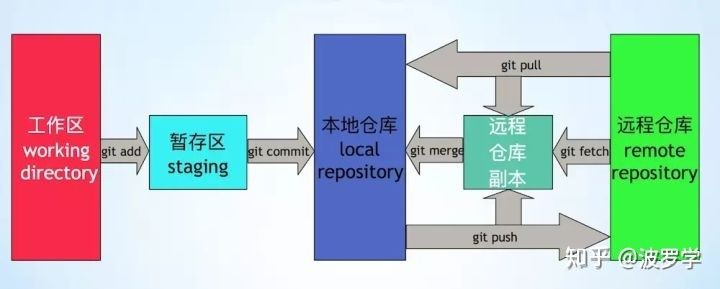
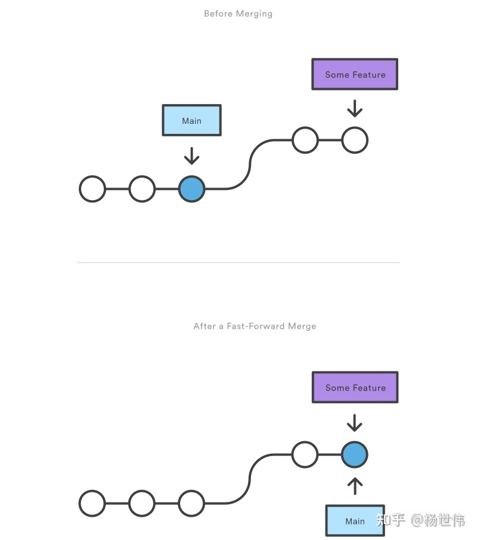
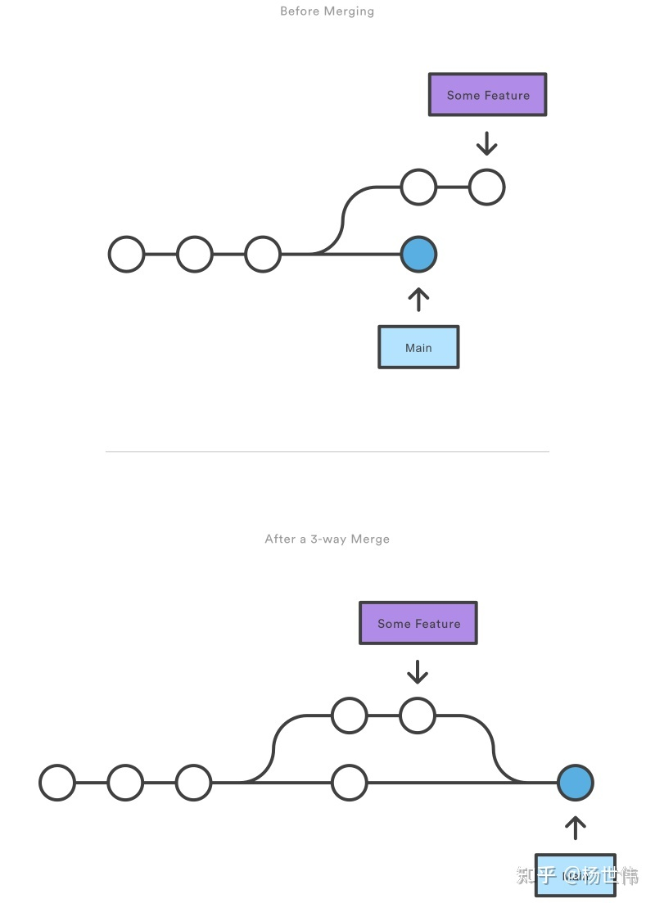
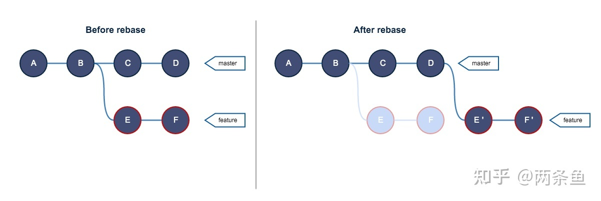

# 常用git命令

## 1、基础设置

### 1、初始化本地仓库

```
git init <目录>
```

该命令会创建默认本地分支(master/main)，并将当前目录作为存储目录，会在当前目录下生成必要的文件。在最后加上<目录>时会改为在指定目录下操作。

### 2、配置

```
git config <--local --global --system> <-e -l -a> [key] [value]
```

更改配置。<--local --global --system>指的是此条命令要更改的配置的级别。git配置三个级别：本地仓库级，全局级，系统级，越靠后覆盖范围越大但优先级越低。-e 编辑配置文件，-l 查看配置 -a 添加配置。不添加以上任何一项（修改配置）或者-a时，最后两项需要是更改或添加的配置名key和要更改的配置值value。

### 3、远程仓库管理

```
git remote <show <仓库名>> <add [仓库名] [url]> <rm [仓库名]> <rename [旧名] [新名]>
```

管理远程仓库信息。不加任何参数或git remove show可以查看远程仓库列表，在show后加仓库名查看指定仓库信息。使用add命令来为当前本地添加远程仓库，使用时跟着的两个参数为此远程仓库的自定义别名和url，**相当于建立了本地仓库和远程仓库的链接，这代表可以给一个本地仓库建立多个远程仓库链接**。使用rm来删除，rename来改名。

## 2、远程仓库交互

### 1、添加至暂存区

```
git add [file1] [file2] [dir]
```

只用file名或dir名来指定提交对象。使用git add .可以将当前目录下文件添加到暂存区。

### 2、提交至本地仓库

```
git commit -m [message] <-a>
```

将暂存区中的内容添加到本地仓库里。-m后添加本次提交的备注描述。使用-a可以省去commit前add的步骤将本地文件直接提交到本地仓库，与add+commit不同的是，-a无法提交未被追踪的文件，即新加文件还是要使用add。

### 3、提交至远程仓库并合并

```
git push [远程主机名] [本地分支名]:[远程分支名] <-f -d>
e.g git push origin master:main
```

将本地分支与远程分支合并。如果本地分支与远程分支名字一样可以省略冒号，就是一般看到的

```
git push origin main
```

样式。github在2020年将默认主分支名由master改为了main，这造成了一些混乱，经常本地主分支是master，远程分支被改成了main，因此有时需要指定，或将名称统一。更改本地默认分支查看“git branch条目”。使用-f（force）参数来强制推送，即忽略本地与远程的差异，当仓库规模较大时慎用。使用-d（delete）删除分支。（这时后面只需要指定远程分支名）

### 4、拉取远程仓库

```
git pull [远程主机名] [远程分支名]:[本地分支名]
```

与push相对应，基本一致。需要注意的是pull实际上是一种粗暴的做法，将远程代码库直接拉取并与本地分支合并，即实际是fetch+merge的组合。如此并不安全，因为可能覆盖本地的一些修改，虽然git的安全检查使得大部分情况下不会造成重大损失。

### 5、克隆仓库

```
git clone [url]
```

直接克隆整个远程仓库。与pull不同的是，clone可以从无到有建立本地分支（即上面命令的集合），无需init等等。

### 6、获取仓库

```
git fetch <仓库名 远程分支名:本地分支名>
```

pull的第一步。什么都不加会fetch已经连接的远程仓库的所有分支，指定仓库名只fetch此仓库的新分支，指定仓库名和远程分支名只fetch此分支。使用这些操作时，只会从远程仓库中获取新信息并暂存为本地的远程仓库分支（origin/main，并不是本地仓库分支如main），因此若要直接创建本地仓库分支，可以指定本地分支名。注意：不能是当前分支。**原理上来说，fetch其实就是根据传入的参数更新指定的FETCH_HRAD，使其指向某分支最后的commit id。**fetch后相当于已经将远程仓库内容拉取到远程分支，要同步到本地分支需要使用merge、checkout等命令。



### 7、分支操作

```
git checkout <-b -f> <分支名/commit_id>
```

最常用的功能是切换分支，指定分支名以切换。如果分支不存在则会报错，但使用-b可以在checkout不存在的分支时创建新分支并切换过去。**究其原理，checkout是将某个commit“检出”到工作区，即用本地版本库的某个commit内容替换当前工作区与暂存区，因此当以分支名为目标时，看起来就像是切换分支一样。**由于checkout实际上是以commit为目标的，因此只要知道commit id，就可以任意切换过去。**如果切换到了一个没有指定分支的commit上，git会提示此时出于游离（detach）态，即此时的HEAD指针直接指向了一个commit而不是分支。此时可以使用-b参数指定一个分支名，新创建一个分支指向此commit，使其“实体化”。**checkout除了应用在分支操作上，在版本控制中也有重要作用，后面再展开。

### 8、合并分支

```
git merge <--no-ff> [分支名/commit_id] 
```

将指定的分支合并入当前分支。**和checkout一样，其原理依然是合并的两个commit，因此可以直接指定commit id。**合并分为两种情况，比较简单的情况是，两个分支是线性的前后关系，**即两个commit有直接血缘关系**，不存在冲突，这种合并将会直接合并，称为fast-forward，如下图。



然而大部分生产环境下并不能这么理想，多人合作项目尤其容易出现冲突。当两个commit处于不同的分叉上，如下图，就需要一定的解决方法了，这种合并称为三路合并。



**三路合并与fast-forward最显著的区别是三路合并将会生成一个新commit来存放两个commit的合并结果，而fast-forward不会。**当然如果认为此次commit需要记录下来，可以使用--no-ff参数，这样即使是fast-forward也会生成新的commit。

三路合并也会根据不同的情况使用不同的合并策略。从两个分支最近的共同祖先commit开始，如果两边所做的修改都不涉及相同的文件，那么git还是可以自动完成合并，只需进行一次确认。如果修改涉及了相同的文件，git就无法替你做主决定该采用哪个分支的修改了，此次合并将停留在中间状态，git将会在产生冲突的文件中对冲突内容进行标注，此时必须人工介入通过各种手段消除冲突，再进行一次提交才算真正合并完成。

## 3、版本控制

### 1、变基

```
git rebase [分支名/commit_id] <i 开始点 结束点> <--continue/--quit/--abort> 
```

和merge类似，功能是将此分支合入其他分支。与merge不同的是，rebase使用的手段是将本分支从两分支的共同祖先commit到最新commit的所有commit从目标分支上**重做**。如下图，e'虽然和e内容一样，但commit id并不同。注意：e和f并没有消失。

相比merge，rebase并不会形成错综复杂的分叉，而是一串线性关系的commit。但代价是，这会改变分支的历史，使结构大变，因此一般rebase后的分支都无法被push到远程（除非-f），因为多人协作时rabase共享分支可能带来灾难性后果。因此**rebase一般只用来处理自己的分支，用来使commit关系整洁。**

当你想在rebase时同时编辑要被rebase的commit时，可以使用-i。在-i后可以指定区间，此区间**左开右闭**（要双闭区间使用^，如HEAD~2^..HEAD）。在交互界面中，你可以选择每个commit保留，编辑，合并或丢弃。

rebase遇到冲突中断后，需要解决冲突，当解决完成，使用git rebase --continue来继续rebase剩下的操作。使用--abort放弃rebase回到rebase之前的样子，使用--quit放弃但不回滚。

### 2、挑选

```
git cherry-pick [分支名/commit_id] <--continue/--quit/--abort> <-m number>
```

功能上与rebase类似，功能是把选定的一个或几个commit应用到本分支，同样也是使用**重做**的方式。最大的区别是，cherry-pick只会在本分支应用所选commit，对于目标commit或分支没有任何影响。可以指定一个commit，或者使用..来指定一个区间，同样是**左开右闭**的。当要pick的commit是一个merge commit时，必须使用-m参数，因为merge commit相当于应用了两个分支的修改，git无法知道你想应用哪一边的修改。-m 1指应用第一个父节点的修改，-m 2代表应用第二个父节点。

### 3、从暂存区或本地仓库中恢复内容

```
git checkout <-f> <./文件名/分支名/commit_id>
```

checkout除了可以用来切换分支，还可以从暂存区或本地仓库中恢复内容。要从暂存区恢复，使用checkout .（一个点）来恢复全部暂存区内容，或直接指定文件名来恢复那个文件。**使用checkout+分支名可以用来切换分支，但从另一个角度理解也可以说是将那个分支的内容恢复到当前暂存区和工作区。**当然，你也可以直接通过commit_id来切换。

checkout的使用是相当安全的。当切换分支时，如果你工作区和暂存区没有未提交的修改，checkout会直接用目标分支的内容覆盖暂存区和工作区。如果此时有修改未提交，checkout会尝试在保留暂存区和工作区的情况下切换分支。如果此时暂存区和工作区所做的修改与目标分支的内容有冲突（比如修改了一个目标分支不存在的文件），checkout会阻止此次切换，提醒你提交此时的修改或暂存。

然而，如果你不需要这种安全检查，可以使用-f参数，这会直接强制用目标分支的内容覆盖暂存区和工作区。这种情况比较常见于你要放弃暂存区和工作区的修改，可以使用git checkout -f，不加分支名相当于切换到当前分支。

### 4、回退

当然可以直接用checkout切换到想要的commit上来实现回退，但这样多少有点不便。

```
git reset [--hard/--soft/--mixed] [commit_id/分支名/HEAD^]
```

reset共有三种模式，默认为mixed，其作用直接引用https://www.cnblogs.com/gradyblog/p/16057738.html：

--hard : 代码库代码回退到某个commit，暂存区和工作区内容**丢弃**

--soft： 代码库代码回退到某个commit，回退的修改和原暂存区的修改一起放入暂存区，**工作区修改保留**

--mixed： 代码库代码回退到某个commit，回退的修改和原暂存区的修改加上工作区的修改**一并放入工作区**

回退的时候用分支太不方便，查commit id更是麻烦的很。可以使用相对位置来表示

#### 4.1 相对位置表示法

参考https://blog.csdn.net/albertsh/article/details/106448035

以HEAD表示原点，可以使用两个符号来表示相对位置：^和~

他们的用法都有两种，连用如 HEAD^^^ HEAD~~~

或加数字HEAD^3 HEAD~3

HEAD^和HEAD~都是HEAD^1，HEAD~1的缩写，都可以理解为后退到上个版本。然而我们知道merge会导致commit关系图分叉，如果一个commit有两个父commit，如何才能分别回退到两个父commit上？

使用~来代指相对位置比较纯粹。它遇到分叉的时候，永远只会选择第一个父commit，因此HEAD\~\~和HEAD~2是相同的。而^加数字则是选择第几个父commit，也就是说，HEAD^^是回退两次每次都选择第一个父commit（也就是和HEAD\~\~、HEAD~2）一致，但HEAD^2是指回退一次到第二个父commit上，如果不存在第二个父commit会报错。

#### 4.2 辨析checkout与reset使用时的区别

最显著的区别是checkout只会移动HEAD指针，而reset会顺带移动之前HEAD附着的分支指针。举例来说，同样是从dev2移动至dev1，使用checkout只会使HEAD指向dev1，dev2留在原地。而使用reset会连带着dev2一块带到dev1来，使得HEAD、dev2、dev1指向同一次commit。

另外，reset的--hard用法是危险操作（不考虑-force），git默认你了解这样做的危险性，会绕过安全检查直接覆盖暂存区和工作区。另外，由于reset会带着分支指针一起移动，这会使得找回commit变得比较麻烦（可以使用git reflog），使用的时候不注意很可能使你的提交历史产生奇怪的分叉。因此一般不推荐在主要公共分支上使用reset，尤其不要在已经push到远程仓库的分支上使用reset。

### 5、反做

```
git revert [分支或commit/范围]
```

撤销某次commit或某几个commit的操作。不同于reset的是，**“反做也是做”**，为了避免像reset一样丢失历史，使用revert会将此次撤销操作也作为一次新的commit提交，相当于把目标commit的行为反着做了一遍，**达到了撤销的效果，却不是撤销。**许多时候要反做一个范围内的所有commit，使用..来指定范围，如HEAD~3..HEAD，这是一个**左开右闭**的区间。

revert当然也会面临产生冲突的时候，一般需要人工解决冲突再提交。

### 6、暂存

```
git stash <list/show/pop/apply/drop> <-u>
```

适用于中断当前工作去处理其他事，暂存当前暂存区和工作区的内容到一个堆栈结构中，如此，使用pop或apply来从暂存区恢复更改，区别是pop在恢复的同时会弹出stash存储，apply不会。使用list来查看stash存储结构，用show+stash@{id}的形式来查看某个stash的内容，使用drop来丢弃暂存内容。

要注意的是stash不会暂存任何未被git跟踪的文件。要暂存这些文件，可以用git add来添加至暂存区来跟踪，或是在使用git stash时使用-u参数。

## 4、查询

查询命令功能都很强大，因此不做过多展开。

### 1、查看提交历史

```
git log <-stat/-p>
```

查看当前分支的提交历史。-stat可以增加显示文件的增删改情况，-p可以更进一步显示文件修改的内容是什么。

### 2、查看从工作区和暂存区的状态和修改状态

```
git status
```

可以查看工作区和暂存区自上次提交以后哪些文件被修改了，哪些文件还没有被追踪。

### 3、查看具体修改了什么/对比分支

```
git diff <--cached/HEAD/分支名 分支名 <文件名>>
```

git diff 显示工作区相对暂存区的修改

git diff HEAD 查看工作区和暂存区相对当前分支最新提交的修改（全部）

git diff --cached 显示暂存区相对当前分支最新提交的修改

使用git diff 分支名 分支名来比较两个分支的差异，再加文件名比较此文件在两个分支中的差异。注意：以前面的分支为基准。

### 4、查看暂存区文件

```
git ls-files
```

### 5、查看与创建分支

```
git branch <分支名> <-r/-d-D>
```

查看分支。加上-r查看远程分支。用git branch 分支名来创建新分支。用-d或-D来删除分支，区别是-d会进行安全检查，如果此分支还没有合并到其他分支，会删除失败，而-D可以强制删除。

### 6、查看对象

```
git cat-file [-p/-t] [对象哈希值]
```

当要查看blob对象、tree对象等时，使用此命令。使用-t来查看对象类型，用-p来查看内容。

### 7、查看引用日志

```
git reflog
```

与git log不同的是，reflog显示的是HEAD的引用历史、操作记录和相应的commit id，据此可以进行追溯操作，比如取消reset造成的回退。

## 5、参考-重要概念

**以下概念只用于理解上述命令，涉及更多原理请百度。**

### 1、三大对象与分支

详细理解太多，百度，简单来说blob存储文件快照（即数据载体），tree对象存储目录信息和指向blob对象的指针（类似文件系统），commit对象是对一条tree对象的封装，除了哈希码和tree对象还附加了提交时间、作者信息、备注，和父提交的id（以便形成图），而一般说的分支（main，master）只是引用，指向一个commit对象。

### 2、FETCH_HEAD

存储在.git/FETCH_HEAD 中，其意义是保存了所有fetch过的远程分支的末端版本，具体来说从其组成上来讲，其记录的就是每个远程分支最后fetch的commit对象的哈希值（即commit id）

### 3、辨析：fetch、checkout、merge、HEAD、FETCH_HEAD等

https://blog.csdn.net/qq_34609889/article/details/88733153

https://www.jianshu.com/p/b494ee197ea8

https://blog.csdn.net/raoxiaoya/article/details/111321583

https://www.bilibili.com/video/BV1h54y1U7Kh/?spm_id_from=333.788&vd_source=85c3cee01922d69c7044a9d320c8a5f4