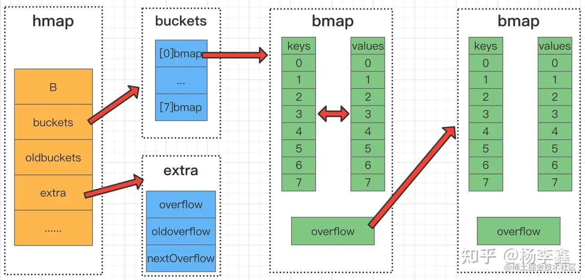

# Golang 复杂类型

## 3、复杂数据结构

### 1、字符串

https://zhuanlan.zhihu.com/p/385624201

```go
var msg string = "hello, world"
// go的字符串的底层是[]byte，即字节数组
s1 := "\110\151" // 底层数组存放的第一个字节是\110，第二个字节是\151
fmt.Println(s1) // Hi
msg[0] = 'L' // go的字符串是不可变的，因此无法编辑：编译错误: cannot assign to msg[0]

// 字符串中的特殊符号当然需要转义
fmt.Println("file_path := \"d:\\a\\b\\c.txt\"") // 输出：file_path := "d:\a\b\c.txt"
// 使用反引号`的字符串表示原生字符串，此时字符串会按照字面处理，不会有任何的转义
fmt.Println(`file_path := "d:\a\b\c.txt"`)

// 索引
s := "hi你好呀"
fmt.Println(s[0]) // 104，UTF-8编码字符是变长的，取不了字符只能取字节
fmt.Println(string(s[0])) // h，可以使用类型转换来输出单字符
// 使用切片也可以转化为字符串输出
fmt.Println(s1[0:1]) // h 前闭后开
fmt.Println(s1[0:2]) // hi
fmt.Println(s1[0:3]) // hi� 一个汉字3个字节，所以取不完会解码失败
fmt.Println(s1[:4]) // hi� 省略第一个参数代表从0开始，省略第二个参数代表到最后结束
fmt.Println(s1[0:5]) // hi你
// 字符串切片和原字符串共享内存，效率很高，放心使用

// 求字符串长度，注意是字节长度不是字符长度
s := "hi你好呀"
fmt.Println(len(s)) // 11 个字节
// 如何求字符串的字符长度？
n := 0
for range s { // range循环会隐式解码字符串，使其遍历字符而不是字节
    n++
}
fmt.Println(n) // 5
// 或者
fmt.Println(utf8.RuneCountInString(s)) // 5

// 实现真正的字符处理？使用[]rune
s := "hi你好呀"
s2 := []rune(s)		// 转化为rune数组，这样就可以像python一样处理字符，也可以修改。
fmt.Println(len(s2)) // 5
fmt.Println(string(s2[2])) // 你
s2[4] = '啊'
fmt.Println(string(s2)) // hi你好啊 修改rune数组是修改的字符

// 常用字符串方法
s := "abc" + "efg" 	// 最常用的字符串拼接方式
b := strings.Join([]string{"abc", "efg"}, "") // join方法传入两个参数，一个字符串数组和一个字符串，用第二个参数作为间隔将第一个参数数组中的字符串元素拼接为一个字符串，可以用来拼接字符串，一般效率比+号高
strings.Replace(str string,old string,new string,n int): // 字符串替换
string.Split(str string,split string): // 返回str split分割的所有子串的slice，类似join
strings.Contains(str string, hasStr string) // 判断是否包含
strings.Index(s string,str string) int: // 判断str在s中首次出现的位置，如果无则返回-1
strings.LastIndex(s string,str string) int: // 判断str在s中最后出现的位置，如果无则返回-1
strings.HasPrefix(s string,prefix string) bool: // 判断字符串s是否以prefix开头
stirngs.HasSuffix(s string,suffix string) bool: // 判断字符串s是否以suffix结尾
```

### 2、数组与切片

**数组**：一句话，不好用，不常用，不推荐用，但是是切片的基础。

```go
var a [3]int 	// 初始化
var p [3]int = [3]int{1, 2, 3}		// 数组初始化以后默认全0值，可以给定数值初始化
var r [3]int = [3]int{1, 2}		// 不全初始化也是可以的，剩余值默认仍是0
fmt.Println(r[2]) // "0"
q := [...]int{1, 2, 3}		// 不指定长度，让编译器推测
// 不同长度的数组是不同的类型 [3]int != [4]int，不可互相赋值
q = [4]int{1, 2, 3, 4} // compile error: cannot assign [4]int to [3]int
nums := [...]int{1: 1, 5: 2} // 索引初始化数组，如果省略了长度则最大的索引+1就是长度
a := [3][2]string{		// 二维数组的定义
    {"林大牛", "林二牛"},
    {"李一蛋", "李二蛋"},
    {"王一炮", "王三炮"},
}
fmt.Println(a) // [[林大牛 林二牛] [李一蛋 李二蛋] [王一炮 王三炮]]
// 多维数组只有行数可以推测，列数不能省略
a := [...][2]string // 可以
b := [3][...]string // 不行

// 数组是值类型，赋值和传参会复制数组而不是传引用，要在函数里改变数组的值要使用指针
func modifyArray(x [3]int) { // 此函数什么作用都没有
    x[0] = 100
}
```

**切片**：动态数组

```go
var arr = [5]int{0, 1, 2, 3, 4} 	// 切片的底层还是数组
s := arr[1:4]	// 通过“切数组”的方式创建切片
r := s[:2]		//当然也可以切切片

var s []int 	// 直接声明一个slice，会是一个nil值，没有底层数组不占空间。
fmt.Println(s == nil) // true

// 要一开始就有数组空间，使用make，参数分别是类型，长度，容量，容量可省略（将会等于长度）
s:=make([]int, 0, 4) 	// 会生成一个匿名底层数组，并使切片指向它

s2 := []int{1, 2, 3, 4, 5} 		// 和数组一样，也可以使用指定元素初始化，只要不指定长度

s:=[]int{111,222,333}	// 超过容量的访问是不允许的
s[3]=444 // 异常：index out of range [3] with length 3

// 要为切片添加元素，使用append
var s []int // // s == nil
s=append(s,111)		// 1、可以一次添加一个元素
s=append(s,222,333,444)		// 2、也可以添加多个元素
s2:=[]int{555,666}		// 3、也添加另一个切片中的元素，但是需要在后面加三个点...
s=append(s,s2...)
fmt.Println(s) // [111 222 333 444 555 666]

// go没有切片中删除元素的api，使用append的添加元组来变相的删除元素
a := []int{30, 31, 32, 33, 34, 35, 36, 37}
// 要删除索引为2的元素
a = append(a[:2], a[3:]...) // 注意第二个参数后面要加三个点...
fmt.Println(a) //[30 31 33 34 35 36 37]

// 使用sort包实现切片排序
var a = [...]int{3, 7, 8, 9, 1}
sort.Ints(a[:])
fmt.Println(a) // [1 3 7 8 9]

// 简单的赋值并不能达到复制切片的效果，因为切片本质是指向数组的指针，赋值会导致新切片仍然指向旧数组
copy(s2, s1)     // 使用copy来深拷贝。注意：源切片s1在后，目标切片s2在前
```
如同Java一样，作为动态数组，slice的底层仍然也是数组，然而可能更贴切的一个说法是，切片是“附着”在数组上的，因为同一个数组上会有很多个切片分别指向数组的不同的片段，go是允许这种情况的，这些切片共享一个底层数组（即数据修改会互相影响）


```go
months := [...]string{1: "January", /* ... */, 12: "December"} // 创建一个数组作为底层
Q2 := months[4:7]		// 对数组进行切片
summer := months[6:9]
// slice的两个关键属性：len长度和cap容量
// len：切片的实际长度，cap：容量，和Java的arraylist几乎一样
// 注意，由于slice不一定从数组第一个元素开始，所以从数组切下来的切片默认容量都是到数组的最后一个元素为止的长度
summer[0]="JUNE"	// 改变一个切片，其他相关切片内容也会变，证明是共用底层数组
fmt.Println(Q2) // [April May JUNE]
fmt.Println(months) // [ ...... JUNE ......]
// 切片可以超过长度继续切，不超过容量就行
fmt.Println(summer[:7]) // 得到了一个更长的切片，元素为：[JUNE July August September October November December]

// 切片是值类型，即引用，所以不能直接比较（通不过编译），函数传的也是本身
func reverse(s []int) {
    for i, j := 0, len(s)-1; i < j; i, j = i+1, j-1 {
        s[i], s[j] = s[j], s[i]
    }
}
func main() {
    x := [5]int{1, 2, 3, 4, 5}
    
    // 1、传入切片，切片引用了数组的全部元素，此时和传入数组指针的效果一样
    reverse(x[:]) 
    fmt.Println(x) // 数组已经被改成了：[5 4 3 2 1]
    
    // 2、传入切片，切片只引用了前两个元素
    reverse(x[:2]) //
    fmt.Println(x) // 只翻转了前两个元素：[4 5 3 2 1]
    
    // 3、传入切片，切片只引用了从索引2一直到最后所有的元素
    reverse(x[2:])
    fmt.Println(x) // [4 5 1 2 3]
}
```

### 3、map

```go
var m map[string]int		// 和slice类似，使用缺省值声明的map不分配空间，相当于nil
fmt.Println(m==nil) // true
var m = make(map[string]int)		// 同样的，使用make来构建map，以分配空间
scoreMap:=map[string]int{		// 带字面量的初始化
    "egon":99,
    "铁蛋":100,
    "铜蛋":88,
}
var scoreMap = map[string]int{}		// 构建一个有空间的map的方法，只是多加了一个{}
fmt.Println(scoreMap == nil) // false

var m = make(map[string]string)
m["name"]="egon"		// 增加元素
delete(m,"gender")		// 删除元素
fmt.Println(m["name"]) // egon 查找元素
// 注意：以上操作都是安全的，即，即使元素不在map中，删和查也不会报错。查找元素会返回类型0值
// 这就带来一个问题，如何判断元素是不在map中还是就是为0呢？
age1,ok:=ages["张三"]		// 访问map的第二个返回值是一个bool，若为true则元素存在
if age, ok := ages["bob"]; !ok { /* ... */ }		// 一种常见用法

for k,v := range ages {		// 遍历，第一第二参数分别为key和value
    fmt.Println(k,v)
}
```

map也是不能寻址（内部元素）、不能比较的

#### 扩展：map实现原理



https://zhuanlan.zhihu.com/p/495998623

扩充和总结：

hmap类似Java中的Hashmap表层数组，buckets是一个桶数组，其中的桶bmap是实际存储的基本单元，bmap类似Java拉链法的链表。一个bmap可以存8个kv对，装满以后会使用下一个bmap作为溢出桶继续存。

存数据的流程是，在buckets中使用哈希算法决定装在哪个桶（bmap）里，先遍历桶查看是否有重复，若无，找到第一个空缺位存入。若桶满，则查找下一个溢出桶。若数据达到一定规模，会触发扩容，每次扩容容量*2，这会导致元素重新排列，可能会落入另一个桶中。

取数据的流程和存差不多，但要遍历一整条溢出桶链，因此map不会装满再扩容，以免效率太低。

map线程不安全。

### 4、type

定义衍生类型与类型别名

```go
type NewInt int  // NewInt具备int类型的特性，但它们是两种类型
var x NewInt = 10
var y int = 10
fmt.Println(x+y) // panic: (mismatched types NewInt and int)

type MyInt = int
var a MyInt = 10  
fmt.Printf("%T",a)  // 打印a的类型就是int
```

最主要的作用是声明结构体（struct）

```go
// 类型相同的字段也可以写在同一行
type Person struct {
    name, sex, city string // 写在一行
    age             int
    hobbbies        []string
    sanwei          map[string]float64
}

var p1 Person  		// 结构体的“实例化”
fmt.Println(p1.name)            // 空串，默认0值
p1.name = "egon"		// 赋值

var p1 Person = Person{		// 实例化的同时赋值的第一种方法，使用指定属性名的方式，可以不全赋值，默认0值
    name:     "egon",
    hobbbies: []string{"read", "music"},
}

var p1 Person = Person{		// 或者，按顺序列表，这需要记住属性的顺序，且必须给所有属性赋值，所以不常用
    "egon",
    18,
    "male",
    "Shanghai",
    []string{"read", "music"},
    map[string]float64{
        "xw": 200.3,
        "yw": 30.3,
        "tw": 200.5,
    },
}

// 结构体是值类型，传参会传拷贝，修改不便而且代价太大。使用结构体指针
var p2 *Person
fmt.Println(p2 == nil)  // true 还未分配空间
p3:=new(Person)
p4:=&Person{}  // 与new等同
p4 = &Person{		// 声明+赋值
    name: "egon",
    age: 18,
}

(*p3).name = "egon"
fmt.Println(p3.name)  // egon (*)可省略

// 结构体中当然可以嵌套别的结构体
type Address struct {
    province,city string
}
type Person struct {
    name string
    addr Address
}
// 要访问Person的province字段，需要p.addr.province，如此增长太麻烦了，可以使用提升字段
type Person struct {
    name string
    Address  // 匿名字段
}
fmt.Println(p.Address.province) // 匿名字段默认使用类型名作为字段
fmt.Println(p.province) // 匿名字段可以省略，称之为提升字段
```

结构体如果成员全部可比较，则两个实例也可以互相比较，否则不行。
