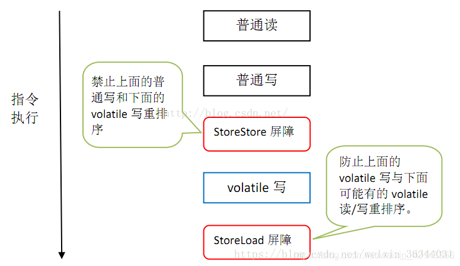

# Go并发&Java并发

在并发的课题中，有许多相似的大问题，因此也有许多类似的解决方案

## 1、简单线程/协程的创建与使用

Java中创建线程进行并发的最简单方式就是继承Thread类或者实现Runnable接口

```java
public class MyThread extends Thread {
    public void run() {
    System.out.println("MyThread.run()");
    }
}
MyThread myThread1 = new MyThread();
myThread1.start();

// 函数式的简便写法，所有需要提交函数体的地方都可以这样使用
public class Test {
    public static void main(String[] args) {
        new Thread(() -> {   
            //发送MQ
            setMsg(msgInfo);
            //msgInfo是自定义个一个类，里面有很多参数
        }).start();
    }
}

// 由于Java的单继承特性，若类已经继承了别的类无法继承Thread类，便只能实现Runnable接口
public class MyThread extends OtherClass implements Runnable {
    public void run() {
    System.out.println("MyThread.run()");
    }
}
// 启动 MyThread，需要首先实例化一个 Thread，并传入自己的 MyThread 实例：
MyThread myThread = new MyThread();
Thread thread = new Thread(myThread);
thread.start();
//事实上，当传入一个 Runnable target 参数给 Thread 后，Thread 的 run()方法就会调用
```

在Go中，使用go关键字来创建一个goroutine来执行。

```go
var wg sync.WaitGroup //WaitGroup等待方法 先不用管
func hello(i int){
	fmt.Println("Hello hello",i)
	wg.Done() //此方法如果运行 ，通知wg把计数器 -1
}
func main() {  // 开启一个主goroutine去执行mian函数
	wg.Add(10000)//（计数器）只有一个小弟为1,等待wg.Done()后-1，为0时停止等待
	for i:=0; i<10000;i++{
		//wg.Add(1) 可以给定10000个goroutine 也可以，每次循环+1
		go hello(i) // 开启了一个独立的 goroutine去执行hello这个函数
	}
	fmt.Println("Hello main")
	// 让我们的主goroutine 等待 goroutine 小弟 执行
	// 如果不等待，独立的goroutine小弟，可能小弟这个goroutine还没有运行
	//time.Sleep(time.Second) 第二种等待
	wg.Wait()//等待所有小弟干完活
}
```

有两点需要注意：

**一、一般习惯上把go的并发称为多协程而不是多线程。**这是由于相对于Java的一个线程就对应操作系统的一个线程，使用go关键字创建的goroutine是用户态的协程，它与线程有以下区别于联系：

1、协程是用户态的。协程的管理依赖Go语言运行时的调度器。同时，Go语言中的协程是从属于某一个线程的，协程与线程的对应关系为M：N，即多对多。

2、上下文切换机制不同。协程的速度要快于线程其原因在于协程切换不用经过操作系统用户态与内核态的切换。

3、调度方式不同。go自己实现的调度器是非抢占式的，一般的，一个协程的持续工作时间会比操作系统中线程长，因为操作系统线程会被经常的强制切换上下文。

4、栈空间大小不同。线程栈大小固定为2M（可能随操作系统变化，但都是固定的），协程的大小范围为2KB-1GB，动态调整，非常灵活。

二、**WaitGroup是什么？详见下一章。**对于Java使用者可以如此理解：不同于JVM，Go程序的生命周期随main函数结束而结束，因此需要main函数“停下来等”子线程。因此WaitGroup的作用类似于使用了针对所有线程的join()。

## 2、线程/协程的生命周期

首先一点要明确的是：许多教程，尤其Java的教程中，经常用父子线程来描述线程及其衍生线程。这固然易于理解线程之间的衍生关系，但从系统层面，**Java除守护线程以外的所有线程地位相同，Go除主协程以外的所有协程地位相同**。有必要复习一下两种语言程序，或者说进程的正常退出方式：

Java程序随着JVM实例的结束而结束，JVM的退出条件是**所有非守护线程都执行完毕**。

Go程序的入口是main()函数，程序也会**随着main函数的执行完毕而结束**。

因此，一个Go语言中常见的错误是在主函数中不加任何处理就创建goroutine使用。这会导致main函数提交goroutine后程序立即退出导致部分甚至全部goroutine都没有得到执行。

虽然Go需要手动写等待机制让main函数等待goroutine很麻烦，但这也带来了安全性保证：在你想结束程序的时候，只需要让main函数结束就行了，其他goroutine会自动消亡。而Java不行，如果你不慎制造了一些死锁线程且未作处理， 程序将无法正常停止。要达到Go中线程随main消亡的效果，可以使用**守护线程**。

```java
DaemonRunnable runnable = new DaemonRunnable();
Thread thread = new Thread(runnable);
thread.setDaemon(true);
thread.start();
Random random = new Random();
Integer sec = random.nextInt(10);
System.out.println("警告：" + sec + "秒后主线程退出");
Thread.sleep(sec * 1000);
System.out.println("警告：主线程宣告退出！");
```

```
进入守护线程...
警告：8秒后主线程退出
当前:2021-10-09 15:40:00 | 守护线程进行中,目前计数至【1】
当前:2021-10-09 15:40:01 | 守护线程进行中,目前计数至【2】
当前:2021-10-09 15:40:02 | 守护线程进行中,目前计数至【3】
当前:2021-10-09 15:40:03 | 守护线程进行中,目前计数至【4】
当前:2021-10-09 15:40:04 | 守护线程进行中,目前计数至【5】
当前:2021-10-09 15:40:05 | 守护线程进行中,目前计数至【6】
当前:2021-10-09 15:40:06 | 守护线程进行中,目前计数至【7】
当前:2021-10-09 15:40:07 | 守护线程进行中,目前计数至【8】
警告：主线程宣告退出！
```

### Java线程的操作

Java由命令来直接管理线程的生命周期，可以显示的阻塞、中断线程。Go使用通信的方式来达成同样的效果，具体参考第5章

#### start/run

上文可看出，线程需要执行的方法体需要写在run()方法中，而使线程开始执行需要调用start()方法。调用start()来启动线程后，线程才能并发地由CPU调度执行，如果直接调用run()相当于在主线程中执行了一个普通方法，无法做到并发

#### wait

[共享变量].wait()

```java
synchronize(obj) {
	while (条件不满足) {	//例如生产者可以判定 while (queue.size == MAX_SIZE)
		obj.wait();
	}
}
```

调用线程会被挂起，并且释放**该共享变量**的锁资源，直至：

- 其他线程调用该共享变量的 `notify()`  或 `notifyAll()`方法

- 其他线程调用该线程 `interrupt()` 方法，线程抛出`InterruptedException`异常返回

wait(long timeout)：设置超时时间，超时后会自动唤醒

#### notify/notifyAll

[共享变量].notify()

调用后，会**随机**唤醒一个在共享变量上调用`wait()`方法挂起的线程

被唤醒的线程不会马上从`wait()`返回，需要获得锁后才可以返回

[共享变量].notifyAll()会唤醒所有被挂起的线程

#### join

[线程].join()

临时挂起本线程，等待调用的另一个线程执行完再继续执行，底层调用的wait来实现

```java
public void run() {
    System.out.println(Thread.currentThread().getName() +"正在等待大家的到来.....");
    try {
        // 待其他线程执行完成后在执行下面的代码
        thread2.join();
    } catch (InterruptedException e) {
        e.printStackTrace();
    }
    System.out.println("人齐了，"+Thread.currentThread().getName() +"服务员开始上菜");
}
```

#### yield

[线程].yield()

让出执行机会，回到可执行状态，立刻使CPU进行一次调度，因此yield有可能完全没有作用，因为如果只有自己一个线程则让无可让，就算有多个线程，CPU调度仍然可能选择调度本线程

```java
public void run() { 	
    for (int i = 1; i <= 100; i++) 	{ 		
        if (i < 100 && getName().equals("t1")) 			
            yield(); 		
        System.out.println(getName() + ":" + i); 	
    } 
}
```

#### sleep

[线程].sleep(long time)

睡眠一段时间，以毫秒为单位。sleep相比wait不会释放持有的锁，睡眠完成会继续执行。sleep可以相应interrupt()

```java
while (true){
    if (ticketNums<=0){
        break;
    }
    try {
        Thread.sleep(5000);      //让线程睡了5秒的时间     （模拟网络延迟）
    }catch (InterruptedException e){
        e.printStackTrace();
    }
    System.out.println(Thread.currentThread().getName()+"-->拿到了第"+ticketNums--+"票");
}
```

#### interrupt

用来中断线程，需要注意的是interrupt()只是设置线程的中断标志，不能终止线程运行，而是被中断的线程根据中断状态自行进行处理

- `void interrupt()`：设置中断标志位为 true；

  > 若线程调用 `wait()`、`sleep()`、`join()`方法**被阻塞挂起**，会抛出`InterruptedException`异常，无论调用这些方法和调用interrupt()谁先谁后

- `boolean isInterrupted()`：检查当前线程是否被中断

- `static boolean interrupted()`：检测**当前线程**是否被中断，若被中断，则会清除中断标志。

static boolean interrupted()`和 `void interrupt()区分

`interrupt()`是调用线程的标志位。

`isInterrupted()`是当前线程的标志位（并非调用线程）。

```Java
public static void main(String[] args) throws InterruptedException{
   	Thread threadOne = new Thread(new Runnable() {
        public void run() {while(true);}
    });
    
    threadOne.start();
    
    threadOne.interrupt();
    threadOne.isInterrupted(); //true，调用线程是 threadOne
    
    threadOne.interrupted();	//false，当前线程是主线程
    Thread.interrupted();	//false，当前线程是主线程
}
```

#### stop

以拉闸的方式关闭线程，不推荐

## 3、池

一个个创建线程进行管理显然太笨重，于是自然而然想到了池化

### 1、Java线程池

与线程池大小相关有两个重要参数：

corePoolSize：核心线程数。可以称作线程池的舒适工作大小，当线程数量小于核心线程时，默认即使空闲也不会销毁任何线程，除非专门设置

maximumPoolSize：最大线程数。随着入池任务的增加，如果数量大于了核心线程数，后来的任务会放入一个阻塞队列（称为工作队列）做缓冲。如果工作队列也盛不下了，就会开启临时线程去执行这些新任务。临时线程的数量不是无限扩张的，这个参数决定了线程池的最大大小。当临时线程空闲一段时间，它会被销毁。如果达到了最大线程数任务仍然源源不断的来，则会执行**拒绝策略**

拒绝策略：

```
1. AbortPolicy ： 直接抛出异常，阻止系统正常运行。
2. CallerRunsPolicy ： 只要线程池未关闭，该策略直接在调用者线程中，运行当前被丢弃的任务。显然这样做不会真的丢弃任务，但是，任务提交线程的性能极有可能会急剧下降。
3. DiscardOldestPolicy ： 丢弃最老的一个请求，也就是即将被执行的一个任务，并尝试再次提交当前任务。
4. DiscardPolicy ： 该策略默默地丢弃无法处理的任务，不予任何处理。如果允许任务丢失，这是最好的一种方案。
```

线程池种类：

```
newSingleThreadExexcutor：单线程数的线程池（核心线程数=最大线程数=1）
newFixedThreadPool：固定线程数的线程池（核心线程数=最大线程数=自定义）
newCacheThreadPool：可缓存的线程池（核心线程数=0，最大线程数=Integer.MAX_VALUE）
newScheduledThreadPool：支持定时或周期任务的线程池（核心线程数=自定义，最大线程数=Integer.MAX_VALUE）
```

实际的一个例子

```java
ExecutorService pool = Executors.newFixedThreadPool(10);
for (int i = 0; i < 10; i++) {
    pool.execute(() -> {
        System.out.println(i);
    });
}
```

JDK1.8之后使用lambda表达式来创建提交任务，使得线程池使用极为方便

提交任务使用execute或submit方法，区别如下：

```
1、execute只能提交Runnable类型的任务，没有返回值，而submit既能提交Runnable类型任务也能提交Callable类型任务，返回Future类型。
2、execute方法提交的任务异常是直接抛出的，而submit方法是是捕获了异常的，当调用FutureTask的get方法时，才会抛出异常。
```

Future相关见第5章

### 2、Go对象池

由于Go协程的轻量性和伸缩性，Go官方并没有提供协程池的支持，下面是一些较有名的第三方协程池：

（1）[Jeffail/tunny](https://github.com/Jeffail/tunny)
（2）[panjf2000/ants](https://github.com/panjf2000/ants)

参考https://blog.csdn.net/K346K346/article/details/104370501

Go中有可能大量创建且消耗资源的是对象（结构体），因此对应的官方推出了临时对象池

```go
package main
import (
  "fmt"
  "sync"
)
var pool *sync.Pool // 定义对象池
type Person struct { // 需要池化的对象
  Name string
}
func initPool() {
  pool = &sync.Pool { // 初始化池时，需要给定创建对象的方法
    New: func()interface{} {
      fmt.Println("Creating a new Person")
      return new(Person)
    },
  }
}
func main() {
  initPool()
  p := pool.Get().(*Person) // 在池内获取一个对象，如果池内没有对象会创建，否则会返回已有的对象
  fmt.Println("首次从 pool 里获取：", p)
  p.Name = "first"
  fmt.Printf("设置 p.Name = %s\n", p.Name)
  pool.Put(p)	// 归还对象
  fmt.Println("Pool 里已有一个对象：&{first}，调用 Get: ", pool.Get().(*Person))
  fmt.Println("Pool 没有对象了，调用 Get: ", pool.Get().(*Person))
}
```

sync.pool不是一个常用的工具，在使用时需要注意：

1、池中的对象随时都可能被无通知的gc，因此不适合保存持久异化对象

2、不要先put进池一个对象，再试图get把它取出来，由于1和其他的各种原因，有极大的概率拿不到你想要的

## 4、线程/协程的基于变量同步方式

并发要解决的最重要的问题之一就是线程同步问题，进一步来说就是解决多线程环境下对共享资源的竞争问题。而根据并行转串行的思路，解决冲突最简单的方式就是加锁，锁的范围越大安全性越高，性能也越低。

### 1、Java的重量级同步

#### Synchronized

最简单的锁，在用法上有两种方式

```java
public synchronized void method() // 修饰方法
{
   // todo
}

public void method()	// 修饰代码块
{
   synchronized(this) {
      // todo
   }
}

private Account account;	// 修饰代码块时，填this是锁定当前对象，也可以指定一个对象
public void run() {
    synchronized (account) {
        // todo
    }
}
```

从范围上，又分为对象锁和类锁两种。

```java
// 对象锁，顾名思义锁同一个实例对象
public class SynchronizeAndObjectLock2 {
    public synchronized void test1(){
		// todo
    }
    public synchronized void test2(){
        // todo
    }
    public void test3(){
        synchronized(this) {
            // todo
        } 
    }
    private Object objectLock = new Object();
     public void test4(){
        synchronized(objectLock) {
            // todo
        }
    }
    public void test5(){
        synchronized(objectLock) {
            // todo
        }
    }
    public static void main(String[] args) throws Exception {
        // 【注意】当且仅当是同一个SynchronizeAndObjectLock2对象
        SynchronizeAndObjectLock2 synchronizeAndObjectLock2 = new SynchronizeAndObjectLock2();、
        SynchronizeAndObjectLock2 synchronizeAndObjectLock2_1 = new SynchronizeAndObjectLock2();
        new Thread(() -> {
            synchronizeAndObjectLock2.test1();
        }).start();
        new Thread(() -> {
            synchronizeAndObjectLock2_1.test2();
        }).start(); 
        new Thread(() -> {
            synchronizeAndObjectLock2.test3();
        }).start();
        new Thread(() -> {
            synchronizeAndObjectLock2.test4();
        }).start();
        new Thread(() -> {
            synchronizeAndObjectLock2.test5();
        }).start();
    }
} // 上例中1 3互相冲突，4 5互相冲突。1 3都是指向了对象synchronizeAndObjectLock2，而2指向了对象synchronizeAndObjectLock2_1，因此不会冲突。4 5都在代码块中指定了对象objectLock，因此冲突
```

```java
// 锁类对象或者锁静态方法都是使用类锁
class ClassLock2 {
    public synchronized static void test1(){
        // todo
    }
    public synchronized static void test2(){
        // todo
    }
    public static void test3(){
        synchronized (ClassLock2.class) {
			// todo
        }
    }
}

public static void main(String[] args) throws Exception {
    new Thread(() -> {
        // new了一个ClassLock对象
        new ClassLock().test1();
    }).start();
    new Thread(() -> {
        // new了另一个ClassLock对象
        new ClassLock().test2();
    }).start();
    new Thread(() -> {
        // new了另一个ClassLock对象
        new ClassLock().test3();
    }).start();
} // 显然，这三个方法都冲突。即使创建了不同的对象，但使用的都是同一个类对象，所有加了synchronized的属于同一类对象的方法都互相冲突（单static不加synchronized不冲突
```

```java
// 对象锁和类锁不会互相影响
public class ClassAndObjectLock {
    public static void test1(){
        synchronized (ClassAndObjectLock.class) {
            // todo
        }
    }
 
    public void test2(){
        synchronized (this) {
            // todo
        }
    }
        public static void main(String[] args) throws Exception {
        new Thread(() -> {
            ClassAndObjectLock.test1();
        }).start();
 
        new Thread(() -> {
            new ClassAndObjectLock().test2();
        }).start();
    }
} // 1 2不会互斥，因为对象锁和类锁是独立的
```

```java
// synchronized可重入
public class SynchronizeAndReentrant {
    public static void main(String[] args) throws Exception {
        SynchronizeAndReentrant synchronizeAndReentrant = new SynchronizeAndReentrant();
        synchronizeAndReentrant.test1();
    }
    public synchronized void test1(){
        System.out.println(" test1 method is called...");
        test2();
    }
    public synchronized void test2(){
        System.out.println(" test2 method is called...");
        test2();
    }
} // 显然，无论是不同方法还是相同方法，只要是同一个线程就可以反复获取本来冲突的锁
```

#### ReentrantLock

和synchronized相比，reentrantlock更灵活，用法更多，但需要显式的加锁解锁。

```java
ReentrantLock lock = new ReentrantLock(true);
lock.lock();
try {
    // ReentrantLock也可重入，且支持多种加锁方式
    if(lock.tryLock(100, TimeUnit.MILLISECONDS)){ }
} finally {
    lock.unlock();
}
```

```
0、ReentrantLock(boolean fair)：构建一个ReentrantLock。若无参则为非公平锁，传入一个true则为公平锁
1、void lock(): 执行此方法时, 如果锁处于空闲状态, 当前线程将获取到锁. 相反, 如果锁已经被其他线程持有, 则阻塞, 直到当前线程获取到锁.
2、boolean tryLock()：如果锁可用, 则获取锁, 并立即返回 true, 否则返回 false. 该方法和lock()的区别在于, tryLock()只是"试图"获取锁, 如果锁不可用, 不会导致当前线程被阻塞,当前线程仍然继续往下执行代码. 而 lock()方法则是一定要获取到锁, 如果锁不可用, 就一直等待
3、void unlock()：执行此方法时, 当前线程将释放持有的锁. 锁只能由持有者释放, 如果线程并不持有锁, 却执行该方法, 可能导致异常的发生.
4、isLock()：此锁是否有任意线程占用
5、lockInterruptibly（）：与lock类似，获取锁，但会对Interrupt做出相应，包括获取锁前和获取中，都会相应Interrupt
6、tryLock（）：尝试获得锁，仅在调用时锁未被线程占用，获得锁
7、tryLock(long timeout TimeUnit unit)：如果锁在给定等待时间内没有被另一个线程保持，则获取该锁。
```

synchronized阻塞队列只有一个，当调用notify时不知道响应的会是哪个。ReentrantLock可以使用Condition来定义多个等待队列。

```java
static Condition cigaretteRoom = lock.newCondition();
static Condition eattingRoom = lock.newCondition();

cigaretteRoom.await();
eattingRoom.await();

cigaretteRoom.signal(); // 可以只唤醒一个
```

### 2、Go的重量级同步

#### sync.Mutex

```go
var (
	x int
	lock sync.Mutex //互斥锁
)

func add(){
	for i:=0;i<50000000;i++{
		lock.Lock() //加锁
		x = x + 1
		lock.Unlock() //解锁
	}
}
```

显然，由于Go的设计理念，Go的锁设计功能并不那么强大。Go的互斥锁**无法显式的指定公平或非公平**，而是由内部机制决定。简而言之，**默认情况下为非公平锁，当有协程等待时间过久则转为公平锁**

看起来sync.Mutex的使用和Java的ReentrantLock类似，然而Go的互斥锁**不支持可重入**，甚至连TryLock这样的功能**也在1.18版本后才支持**（2022.3之后）

```go
var m = sync.Mutex{}
if m.TryLock(){
    // 加锁成功的逻辑
}else {
    // 加锁失败的逻辑
```

### 3、Java的中量级锁

完全的独占锁对性能的影响太大，因此一个较为中量级的解决方案是读写锁，即当一个线程获取读锁时，其他线程仍可获得读锁；当一个线程获取写锁时相当于独占锁，其他线程的读写锁获取都将失败。

#### ReentrantReadWriteLock

```java
private ReadWriteLock readWriteLock = new ReentrantReadWriteLock();
public void method1() {
    //readWriteLock.readLock().lock();
    readWriteLock.writeLock().lock();
    try {
        // todo
    } catch (Exception e) {
        e.printStackTrace();
    } finally {
        //readWriteLock.readLock().unlock();
        readWriteLock.writeLock().unlock();
    }
}
```

ReentrantReadWriteLock可以实现锁降级，即从写锁转为读锁

```java
private ReadWriteLock rwl =new ReentrantReadWriteLock();
//读锁
private Lock r =rwl.readLock();
//写锁
private Lock w =rwl.writeLock();
//声明一个map,存储数据
private Map<String,Object> map =new HashMap<>();
//声明一个boolean类型的状态，用于判断是读操作还是写操作;volatile关键字保证可见性
private volatile boolean isUpdateStatus;
//定义一个读写方法
public void readWriteMethod(){
    r.lock();//为了保证isUpdateStatus能够获取到最新的值，添加读锁
    if(isUpdateStatus){//如果isUpdateStatus是最新的值
        r.unlock();//因为要进行写操作，所以需要释放读锁
        w.lock();//在写操作之前，为了保证写的状态，需要加写锁
        map.put("key1","v1");//写操作
        //开始锁降级;
        //再写操作没有释放的时候，获取到读锁，再释放写锁
        r.lock();
        w.unlock();//写操作完成后释放写锁
        //锁降级完成;
    }
    Object obj = map.get("key1");//写操作
    r.unlock();//释放读锁
    System.out.println(Thread.currentThread().getName()+"读操作获取到的值："+obj);
}
```

**锁升级ReentrantReadWriteLock不支持**，当有其他线程持有读锁时，没有线程可以获得写锁。设想如果支持，其他线程的读锁已解锁，则线程自己可以升级获得写锁。然而写一个锁升级的判断很可能导致死锁，比如两个线程都想升级为写锁，又都持有着读锁不解锁，就会陷入互相等待的状态。

### 4、Go的中量级锁

#### sync.RWMutex

```go
var rwlock sync.RWMutex
func read()  {
	rwlock.RLock()
	time.Sleep(time.Millisecond)
	rwlock.RUnlock()
}
func write()  {
	rwlock.Lock()
	time.Sleep(time.Millisecond*10)
	rwlock.Unlock()
}
```

值得注意的是sync.RWMutex通过优化降低了饥饿问题。当一个写锁解锁时，优先使阻塞的读锁获得锁，以避免读操作饿死；当已有协程获得读锁，另一线程尝试获取写锁时，虽然它会被阻塞，但也会同时阻塞其他新的尝试获取读锁的协程，以避免写操作饿死。

### 5、Java的中重量级其他同步

除了硬性的对某一资源上锁，并发时有时会有更复杂的需求。

#### 等待同步：CountDownLatch

设定一个计数器，传入一个数字作为计数器最大值；调用countDown()来使计数器减1，调用await()来使线程阻塞等待，当计数器减至0时会唤醒所有被await()阻塞的线程继续执行。await()方法可以传入超时时间，当超时但计数器仍未归0则继续执行。

```java
public static void main(String[] args) throws InterruptedException {
        CountDownLatch latch = new CountDownLatch(10);
        for (int i=0; i<9; i++) {
            new Thread(new Runnable() {
                @Override
                public void run() {
                    System.out.println(Thread.currentThread().getName() + " 运行");
                    try {
                        Thread.sleep(3000);
                    } catch (InterruptedException e) {
                        e.printStackTrace();
                    } finally {
                        latch.countDown();
                    }
                }
            }).start();
        }
 
        System.out.println("等待子线程运行结束");
        latch.await(10, TimeUnit.SECONDS);
        System.out.println("子线程运行结束");
}
```

这个例子比较类似开头Go的waitgroup例子。

#### 等待同步：CyclicBarrier

回环栅栏可以实现与CountDownLatch类似的功能，初始化时传入parties表示需要多少个线程同步，调用await()阻塞当前线程来等待其他线程。当被await()阻塞的线程数量达到parties则所有线程都将继续执行，同样也可以向await()传入超时时间。与CountDownLatch相比，CyclicBarrier更方便，且它可以重用，也就是说CountDownLatch到达0后就不可再使用了，而CyclicBarrier可以分批同步线程。

```java
CyclicBarrier cyclicBarrier = new CyclicBarrier(3);
new Thread(() -> {
    try {
        Thread.sleep(10_000);
        cyclicBarrier.await();   // 等另外一个一个线程准备好 然后开始做事情
    } catch (InterruptedException | BrokenBarrierException e) {
        e.printStackTrace();
    }
}).start();
new Thread(() -> {
    try {
        Thread.sleep(5_000);
        cyclicBarrier.await(); // 等另外一个一个线程准备好 然后开始做事情
    } catch (InterruptedException | BrokenBarrierException e) {
        e.printStackTrace();
    }
}).start();
cyclicBarrier.await();
while (true){
    if (cyclicBarrier.getNumberWaiting()==0){
        System.out.println("开始");
        return;
    }
}
```

#### 信号量：Semaphore

信号量是一个经典的概念，在操作系统中也有诸多应用。主要运行逻辑比较类似桶：用一个数字表示资源数量，线程可以获取一个或多个资源，使信号量减去对应数量，用完要归还（加回来）。如果资源为0，则后续的资源请求都会阻塞。使用信号量可以控制最大并发量。

```
0. Semaphore(int permits, *optional* boolean fair) 初始化一个信号量。使用permits指定初始信号量大小，可以指定fair来使竞争策略公平或非公平，默认非公平（false）
1. public void acquire(): 用来获取一个许可，若无许可能够获得，则会一直等待，直到获得许
可。
2. public void acquire(int permits):获取 permits 个许可
3. public void release() { } :释放许可。注意，在释放许可之前，必须先获获得许可。
4. public void release(int permits) { }:释放 permits 个许可
5. public boolean tryAcquire():尝试获取一个许可，若获取成功，则立即返回 true，若获取失
败，则立即返回 false
6. public boolean tryAcquire(long timeout, TimeUnit unit):尝试获取一个许可，若在指定的
时间内获取成功，则立即返回 true，否则则立即返回 false
7. public boolean tryAcquire(int permits):尝试获取 permits 个许可，若获取成功，则立即返
回 true，若获取失败，则立即返回 false
8. public boolean tryAcquire(int permits, long timeout, TimeUnit unit): 尝试获取 permits
个许可，若在指定的时间内获取成功，则立即返回 true，否则则立即返回 false
9. 还可以通过 availablePermits()方法得到可用的许可数目。
10、public int drainPermits(): 直接清零信号量，并返回因此减少的值
11、protected void reducePermits(int reduction): 使信号量减少一定数。与acquire不同的是，此方法不会阻塞，因此有可能使信号量变为负值。
```

一个经典的停车例子

```java
public static void main(String[] args) {
    //定义semaphore实例，设置许可数为3，即停车位为3个
    Semaphore semaphore = new Semaphore(3);
    //创建五个线程，即有5辆汽车准备进入停车场停车
    for (int i = 1; i <= 5; i++) {
        new Thread(() -> {
            try {
                System.out.println(Thread.currentThread().getName() + "尝试进入停车场...");
                //尝试获取许可
                semaphore.acquire();
                //模拟停车
                long time = (long) (Math.random() * 10 + 1);
                System.out.println(Thread.currentThread().getName() + "进入了停车场，停车" + time +
                                   "秒...");
                Thread.sleep(time);
            } catch (InterruptedException e) {
                e.printStackTrace();
            } finally {
                System.out.println(Thread.currentThread().getName() + "开始驶离停车场...");
                //释放许可
                semaphore.release();
                System.out.println(Thread.currentThread().getName() + "离开了停车场！");
            }
        }, i + "号汽车").start();
    }
}
```

```
1号汽车尝试进入停车场...
5号汽车尝试进入停车场...
4号汽车尝试进入停车场...
3号汽车尝试进入停车场...
2号汽车尝试进入停车场...
5号汽车进入了停车场，停车5秒...
1号汽车进入了停车场，停车8秒...
4号汽车进入了停车场，停车9秒...
5号汽车开始驶离停车场...
5号汽车离开了停车场！
3号汽车进入了停车场，停车10秒...
1号汽车开始驶离停车场...
1号汽车离开了停车场！
2号汽车进入了停车场，停车2秒...
4号汽车开始驶离停车场...
4号汽车离开了停车场！
2号汽车开始驶离停车场...
2号汽车离开了停车场！
3号汽车开始驶离停车场...
3号汽车离开了停车场！
```

### 6、Go的中重量级其他同步

#### 等待同步：WaitGroup

```go
func process(i int, wg *sync.WaitGroup) {  
    fmt.Println("started Goroutine ", i)
    time.Sleep(2 * time.Second)
    fmt.Printf("Goroutine %d ended\n", i)
    wg.Done() // 资源-1
}

func main() {  
    no := 3
    var wg sync.WaitGroup
    for i := 0; i < no; i++ {
        wg.Add(1) // 资源+1
        go process(i, &wg)
    }
    wg.Wait() // 等待直到计数为0
    fmt.Println("All go routines finished executing")
}
```

与Java CountDownLatch类似，不过显然WaitGroup可重用，因为WaitGroup有Add方法来增加计数，某种层面也有点像信号量。Add可以传入负值，表示减少n个资源，但是不可以减为负数。注意WaitGroup可复制，但没有意义，使用应该传指针或全局变量。

#### 信号量：Weighted

可以看出使用WaitGroup和一些Go中的其他机制可以达到类似信号量的效果。但如果你一定要用正宗的信号量，Go的官方扩展包也有。

安装：

```
go get -u golang.org/x/sync
```

使用


```
type Weighted
    func NewWeighted(n int64) *Weighted 初始化，指定一个初始值
    func (s *Weighted) Acquire(ctx context.Context, n int64) error 获取n个资源。可以使用context来控制超时等
    func (s *Weighted) Release(n int64) 释放n个资源
    func (s *Weighted) TryAcquire(n int64) bool 尝试获取，但不会阻塞
```

### 7、Java的轻量级同步

并发的三特性是原子性、可见性和有序性，或许有时候我们只需要努力确保某几个特性满足就行？

**原子性**：和数据库事物一样，一组操作要不都完成要不都不完成。在并发中比较经典的例子是：i++

i++包含两个操作：读取现有的值，原值+1赋值。在并发中可能出现这种情况：本线程已经读取了现有的值，此时其他线程将变量修改为其他值。此时若本线程进行赋值，则其他线程的赋值操作将丢失。

**可见性**：当多个线程访问同一个变量时，一个线程修改了这个变量的值，其他线程能够立即看得到修改的值。

可见性问题产生的原因是JMM模型的规定。JMM 抽象出主存储器（Main Memory）和工作存储器（Working Memory）两种。线程工作需要修改变量时，必须从主存中复制一份数据到工作内存中修改后再同步回主存，这就产生了i++这种操作在多线程环境下得到非期望值的可能：B线程在自己的工作存储器中对变量所做的修改A线程未必能及时得知。

**有序性**：指令重排不能影响程序的主体逻辑。

指令重排是指，在代码顺序结构中，我们可以直观的指定代码的执行顺序, 即从上到下按序执行。但编译器和CPU处理器会根据自己的决策，对代码的执行顺序进行重新排序，优化指令的执行顺序，提升程序的性能和执行速度，使语句执行顺序发生改变，出现重排序，但最终结果看起来没什么变化。

有序性问题指的是在多线程的环境下，由于执行语句重排序后，重排序的这一部分没有一起执行完，就切换到了其它线程，导致计算结果与预期不符的问题。这就是编译器的编译优化给并发编程带来的程序有序性问题。

典型的场景是状态标志：

```java
public boolean shutdownRequested;    
public void shutdown() {
    // A
    shutdownRequested = true;    
}     
public void doWork() {       
    while (!shutdownRequested) {           
        // B      
    }   
}
```

显然，设计的运行逻辑是在A完成后，通过判断shutdownRequested的方式进行下一步的工作B，B依赖于A的完成。然而实际运行会发现，存在A中操作没有全部完成，shutdownRequested就已经为true并执行B的情况。这就是指令重排将shutdownRequested赋值与A中的操作乱序造成的。

#### volatile

在刚才的例子中将shutdownRequested加上volatile即可解决问题，而不用synchronized上锁。

volatile专注于保证变量的**可见性**和**有序性**，而不保证操作的原子性，使用这种轻量级的操作可以已较低的开销在一些不需要保证原子性的场景下解决并发同步问题。

volatile解决可见性的方式是：1、在本线程缓存中修改变量后刷回主内存。2、将其他线程中的本变量**缓存无效化**。

volatile解决有序性的方式是：内存屏障。

1. 每个volatile写前插入StoreStore屏障；
2. 每个volatile写后插入StoreLoad屏障；
3. 每个volatile读后插入LoadLoad屏障；
4. 每个volatile读后插入LoadStore屏障。



可以看出，内存屏障可以理解为分块，volatile之前的代码块的指令重排的区域就到内存屏障为止，不会涉及volatile读写操作。

```java
volatile boolean shutdownRequested;    
public void shutdown() {
    // A
    shutdownRequested = true;    
}     
public void doWork() {       
    while (!shutdownRequested) {           
        // B      
    }   
}
```

#### Atomic类

volatile解决了可见性和有序性的问题，那么原子类就是用来解决原子性的。

定义

```java
AtomicInteger atomicInteger = new AtomicInteger();
AtomicLong atomicLong = new AtomicLong();
```

原子类可以安全的完成如++之类的复合操作。

一些操作

```java
int addAndGet(int delta): 以原子的方式将输入的数值与实例中的值相加，并返回结果。 
boolean compareAndSet(int expect, int update): 如果当前值等于预期值，则以原子方式将当前值设置为更新的值。 
int getAndIncrement(): 以原子的方式将当前值加 1，注意，这里返回的是自增前的值，也就是旧值。 
void lazySet(int newValue): 最终会设置成newValue,使用lazySet设置值后，可能导致其他线程在之后的一小段时间内还是可以读到旧的值。 
int getAndSet(int newValue): 以原子的方式设置为newValue,并返回旧值。
```

原子类的实现的核心方法是CAS（Compare And Swap）可以看做是乐观锁的实现。即，先检查当前value是否等于current，如果相等，则意味着value没被其他线程修改过。如果不相等则循环继续尝试更新。

数组类：

AtomicIntegerArray: 原子更新整型数组里的元素。 

AtomicLongArray: 原子更新长整型数组里的元素。 

AtomicReferenceArray: 原子更新引用类型数组里的元素。

方法：

```java
get(int index)：获取索引为index的元素值。 
set(int index, int value)：设置值 
compareAndSet(int i, int expect, int update): 如果当前值等于预期值，则以原子方式将数组位置 i 的元素设置为update值。 
```

### 8、Go的轻量级同步

#### atomic原子操作

```go
var i int32 = 100 
func add() { 
    atomic.AddInt32(&i, 1) 
} 
func sub() { 
    atomic.AddInt32(&i, -1) 
} 
```

可以看出，传入一个地址值并进行原子操作的加减。atomic只支持有限的类型：int32、int64、uint32、uint64、uintptr、unsafe.Pointer

#### atomic.Value原子变量

如果是需要以变量形式的原子操作，使用atomic.Value

```go
var v atomic.Value
v.Store(a)	// 存储值，注意在第一次存储值之后，类型就不能再改变了
fmt.Println(v.Load())
```

或许可以很容易猜到，atomic.Value是用interface{}实现的，可以保证对变量操作的原子性——仅限值类型。如果存储了引用类型变量，则其无法保证并发的原子性。

```go
var v atomic.Value
v.Store(s)
s[0] = 666
fmt.Println(s)
fmt.Println(v.Load())
```

## 5、线程/协程基于通信/调用同步方式

线程间的通信除了使用共享内存，也可以使用一些数据结构和类型来实现同步通信。这种方式一般开销更大，但开发难度较低，应用也更广。同时，多线程的问题并不只有简单的资源竞争，异步调用返回值和回调场景下需要使用更多的同步方式来完成任务。

### 1、Java的通信同步方式

#### 阻塞队列与非阻塞队列

阻塞队列 是一个支持两个附加操作的队列。在队列为空时，获取元素的线程会等待队列变为非空。当队列满时，存储元素的线程会等待队列可用。阻塞队列常用于生产者和消费者的场景，生产者是往队列里添加元素的线程，消费者是从队列里拿元素的线程。

```
ArrayBlockingQueue(1000,true) ： 一个由数组结构组成的有界阻塞队列，可以指定公平或非公平。
LinkedBlockingQueue ： 一个由链表结构组成的有界阻塞队列，入队出队的锁是独立的。
PriorityBlockingQueue ： 一个支持优先级排序的无界阻塞队列，默认根据compareTo排序。
DelayQueue： 一个基于延时队列实现的无界阻塞队列，类中元素必须实现Delayed接口，创建元素时指定延时时间，延时小于0时元素才能被出队，队中元素按到期时间排序。
SynchronousQueue： 一个不存储元素的阻塞队列，经典单例，吞吐量较高。
LinkedTransferQueue： 一个由链表结构组成的无界阻塞队列，新增了transfer和tryTransfer方法，用来在有消费者等待的时候将生产者的消息直传给消费者，无需入队。
LinkedBlockingDeque： 一个由链表结构组成的双向阻塞队列。
```

方法

|              | 抛出异常  | 立即返回 | 阻塞   | 超时               |
| ------------ | --------- | -------- | ------ | ------------------ |
| 插入         | add(e)    | offer(e) | put(e) | offer(e,time,unit) |
| 删除         | remove()  | poll()   | take() | poll(time,unit)    |
| 查看队顶元素 | element() | peak()   | 没有   | 没有               |

**抛出异常**：添加时如果空间不足或添加元素为null会报错；删除和查看时队列为空则报错

**立即返回**：添加时空间不足或删除和查看时队列为空非阻塞立刻返回false（offer）或null（poll，peak），否则进行操作并返回true（offer）或对应元素（poll，peak）

**阻塞**：遇到添加时空间不足或删除和查看时队列为空时一直阻塞等待

**超时**：阻塞给定的一段时间，如果还不能进行操作则**立即返回**

**ConcurrentLinkedQueue**是非阻塞队列，是一个基于链接节点的无界线程安全队列。该队列的元素遵循先进先出的原则。该队列不允许null元素。它没有阻塞方法，但是相应的添加和删除方法是基于CAS乐观锁实现，因此性能较高。

### 2、Java的调用同步方式

复杂多线程场景下经常需要在线程完成后将反馈传回给调用者，除了用变量和通信方式完成，Java也对基于调用的同步方式有着充分的支持，这主要是处理返回值和回调问题。

#### Future

```java
public static void main(String[] args) throws InterruptedException,ExecutionException {
    Callable ca2 = new Callable(){
        @Override
        public Object call() throws Exception {
            try {
                Thread.sleep(1000*3);
            } catch (InterruptedException e) {
                e.printStackTrace();
            }
            return "包子准备完毕";
        }
    };
    FutureTask<String> ft2 = new FutureTask<String>(ca2);
    new Thread(ft2).start();
    System.out.println(ft2.get());
}

// 线程池方式
ExecutorService executorService = Executors.newSingleThreadExecutor();
Future<Integer> future = executorService.submit(new Callable<Integer>() {
    @Override
    public Integer call() throws Exception {
        System.out.println("执行耗时操作...");
        timeConsumingOperation();
        return 100;
    }
}); 
// 其他耗时操作..
System.out.println("计算结果:" + future.get());
```

方法

```
get（）方法可以当任务结束后返回一个结果，如果调用时，工作还没有结束，则会阻塞线程，直到任务执行完毕
get（long timeout,TimeUnit unit）做多等待timeout的时间就会返回结果
cancel（boolean  mayInterruptIfRunning）方法可以用来停止一个任务，如果任务可以停止（通过mayInterruptIfRunning来进行判断），则可以返回true,如果任务已经完成或者已经停止，或者这个任务无法停止，则会返回false.
isDone（）方法判断当前方法是否完成
isCancel（）方法判断当前方法是否取消
```

#### CompletableFuture

CompletableFuture主要用来处理回调问题。所谓回调指的是这种场景：类A的`a()`方法调用类B的`b()`方法，类B的`b()`方法执行完毕主动调用类A的`callback()`方法，类似一种反馈通知机制，又或者b()执行完后去执行类c的c()方法，执行独立的逻辑。回调通常需要传入一个函数，当b()方法执行完成后调用，Java中一般传入实例引用，调用实例引用的方法，在JDK1.8加入函数式后这种方法几乎不再使用。回调面临的最大问题是回调地狱（Callback Hell），即b执行完后回调执行c方法，c方法又回调执行了d，如此深入，导致代码可读性差、逻辑难以理清。CompletableFuture在JDK1.8引入，自然而然的支持了函数式编程。

CompletableFuture可以用来管理多个互相之间有依赖关系的future task。一个典型的例子如下

```java
completableFuture = CompletableFuture.supplyAsync(()-> "1")
    .thenCombine(future2， (args1， args2) -> {      
        println(args1);
        println(args2);
        return "3";
    }).thenApply((res) -> {                               
    println(res);
    return "4";
    }).thenApplyAsync((res) -> {                          
        println(res);
        return "5";
});
```

可以看出无论是链式回调还是复杂回调，CompletableFuture都可以以较为清晰的书写方式来编写代码。

方法

```
// 提交任务
runAsync(Runnable runnable)	默认使用 ForkJoinPool 作为线程池执行异步代码，异步操作无返回值
runAsync(Runnable runnable, Executor executor)	使用指定的线程池执行异步代码，异步操作无返回值
supplyAsync(Supplier< U> supplier)	使用 ForkJoinPool 作为线程池执行异步代码，异步操作有返回值
supplyAsync(Supplier< U> supplier, Executor executor)	使用指定的线程池执行异步代码，异步操作有返回值

// 获取结果
get()	和 Future 的对应方法类似，会阻塞调用线程，直到异步任务执行完成
get(long timeout, TimeUnit unit)	异步任务在指定超时时间内没有执行完成则抛出异常
getNow(T valueIfAbsent)	如果结果已经计算完则返回结果或者抛出异常，否则返回给定的缺省值
join()	返回计算的结果或者抛出一个unchecked异常(CompletionException)
complete()	直接设置异步任务的执行结果，但只能调用一次，后续的重复调用会失效。另外如果异步已经执行完毕能够返回结果，此时调用 complete(T t) 则无效
completeExceptionally(Throwable ex)	抛出一个异常，而不是一个成功的结果
```

一些需要示例的方法

```java
CompletableFuture<String> cf = CompletableFuture.supplyAsync(()-> "Hello")
cf
.thenCompose(s -> "Luck") // 最普通的回调，接收上级结果并执行产生新结果
.thenApply(s -> "Luck") // 与thenCompose类似，但返回值不同，thenApply类似streamAPI的map，而thenCompose类似flatmap
.thenApplyAsync(s -> "Luck", pool) // thenApply的线程池版本，提交到线程池执行，不指定线程池则提交到ForkJoinPool
.thenAccept(s -> System.out.println(s)); // 接收上级结果，但无新返回值
.thenRun(() -> System.out.println("无返回值的执行")) // 不接收结果，也不产生新返回值

.thenCombine(cf2,(a,b)->{System.out.println("param a->"+a+",b->"+b)} // 组合两个任务的返回值，并操作形成新返回值，注意两个任务有一个报错则接收参数为异常
.thenAcceptBoth / runAfterBoth //与thenCombine类似，区别是无返回值，runAfterBoth不需要入参

.exceptionally(ex -> {System.out.println("ex:\t"+ex.getMessage());return 0;}) 
// 处理异常，类似catch，没有异常不会执行，可以有返回值
.whenComplete((s, e)-> System.out.println(s)) // 任务都执行成功或报错时执行，类似finally
.whenCompleteAsync((s, e)-> System.out.println(s), pool) // whenComplete的线程池版本，不指定线程池则提交到ForkJoinPool
.handle((s, e)-> "World") // 和whenCompile差不多，但是whenComplete返回值类型和上级结果一致，handle可以不一致，因此可以用来做结果转换
.handleAsync((s, e)-> "World", pool); // handle自然也有线程池版本 
```

或方法，不常用，当两个上级任务执行完成一个就会执行，类似thenCombine、thenAcceptBoth、runAfterBoth

```java
acceptEither(CompletionStage<? extends T> other, Consumer<? super T> action)
applyToEither(CompletionStage<? extends T> other, Function<? super T, U> fn)
runAfterEither(CompletionStage<?> other, Runnable action)
```

### 3、Go的通信同步方式

Go的设计者们坚持CSP（communicating sequential processes）并发模型和其设计理念“Do not communicate by sharing memory; instead, share memory by communicating.”“不要以共享内存的方式来通信，相反，要通过通信来共享内存。”，因此不同于Java如此花样繁多的线程同步方式，Go提供了一些简单的基于变量的线程同步方式，而其重头戏则放在了基于通信的同步方式。

#### channel

channel有点类似Java的阻塞队列，然而Go的channel支持多路复用和定义方向等更强大的功能，以使得一个channel就可以实现Java中future、阻塞队列等许多并发功能，成为了Go并发的心脏。channel本质是一个**结构体**

```go
// 构造
ch1 := make(chan int)
ch3 := make(chan []int)
ch1 := make(chan int,1) // 带缓冲区的channel，相当于队列的长度，注意带缓存的channel是公平的，来了数据会优先通知最早因此而等待的goroutine（FIFO）

// 存取
ch1 <- 10 //把10发送到ch1中
x := <- ch //从ch中接收值并赋值给变量x
<- ch //从ch中接收值,忽略变量
len(ch1)//可以取通道中元素的数量
cap(ch1)//可以拿到通道的容量

// 关闭
close(ch1)
//对一个关闭的通道再发送值就会导致panic。
//对一个关闭的通道进行接收会一直获取值直到通道为空。
//对一个关闭的并且没有值的通道执行接收操作会得到对应类型的零值。
//关闭一个已经关闭的通道会导致panic。

// 通用的取值方式
//从通道中取值方式1，ok用以判断出来的0值是真的0值还是channel为空
for  {
    tmp,ok := <- ch1
    if !ok{
        break
    }
}
// 从通道中取值方式2，当chan被关闭则循环终止，通道不关闭会一直阻塞，如果chan中有nil值，循环将被永远阻塞
for ret:=range ch2{
    fmt.Println(ret)
}

// Go独创的功能是限制channel的方向在函数中只接受或发送
//只能发送
func f1(ch chan<- int){
	for i:=0;i<100;i++ {
		ch <- i
	}
	close(ch)
}
//只能接收ch1,只能发送ch2
func f2(ch1 <-chan int,ch2 chan<- int){
	for  {
		tmp,ok := <- ch1
		if !ok{
			break
		}
		ch2 <- tmp*tmp
	}
	close(ch2)
}
```


#### select多路复用

select 的使用类似于switch语句，它有一系列case分支和一个默认的分支。每个case会对应一个通道的通信（接收或发送）过程。select 会一直等待，直到某个 case 的通信操作完成时，就会执行 case 分支对应的语句。

```go
select{
    case <-ch1:
        ...
    case data := <-ch2:
        ...
    case ch3<-data:
        break // break可以用来退出select，如果select外层有for不会退出for
    default: // 若不设置default，则select会一直阻塞直到有case操作可做。如果设置了，会在没有case可做时执行default
        默认操作
}


for { // select的一个特性是，如果某个chan被关闭，则由于一直0值那个case会一直被执行，可以用赋值为nil的方式退出
	select {
	case x, open := <-inCh1:
		if !open {
			inCh1 = nil
			break
		}
		out<-x
	case x, open := <-inCh2:
		if !open {
			inCh2 = nil
			break
		}
		out<-x
	}

	// 当ch1和ch2都关闭是才退出
	if inCh1 == nil && inCh2 == nil {
		break
	}
}
```

#### channel组合用法

由channel组合可以形成许多我们熟悉的功能体

**构建一个chan来接收某函数的输出流**，可以看出使用闭包返回了关闭chan的方法（从生产端关闭chan才是安全的做法），使用close()来当做通知方式

```go
func producer(generator func() int) (<-chan int, func()) {
	ch := make(chan int)
	done := make(chan struct{})
	go func() {
		defer close(ch) // 重要！
		for {
			select {
			case <-done:
				return
			default:
				ch <- generator()
			}
		}
	}()
	return ch, func() {close(done)} // 通过闭包提供关闭函数
}
```

**用channel实现信号量Semaphore**

```go
sem := make(chan struct{}, 5) // 最多并发5个
for i := 0; i < 100; i++ {
	wag.Add(1)
	go func(id int) {
		defer wg.Done()
		sem <- struct{}{} // 获取信号量
		defer func(){
			<-sem // 释放信号量
		}()		
		// 业务逻辑
		...
	}(i)
}
```

**流水线函数**，从in取值处理后out

```go
func pipeline(in <-chan *Data, out chan<- *Data) {
	for data := range in {
		out <- process(data)
	}
}
// 使用
go pipeline(in, tmp)
go pipeline(tmp, out)	
```

**非阻塞（轮询）**

```go
select {
case ch <- struct{}{}:
default:
}

select {
case val := <-ch:
	...
default:
}
```

很明显，channel的特性很容易就能实现Java的**future**

```go
func main() {
 ch := Request("https://github.com")
 select {
 case r := <-ch:
  fmt.Println(r)
 }
}
func Request(url string) <-chan string {
 ch := make(chan string)
 go func() {
  // 模拟http请求
  time.Sleep(time.Second)
  ch <- fmt.Sprintf("url=%s, res=%s", url, "ok")
 }()
 return ch
}
```

Go实现**wait/notify**,利用的channel的阻塞/唤醒原理

```go
func main() {
 ch := make(chan struct{})
 go func() {
  for i := 1; i < 11; i++ {
   ch <- struct{}{}
   //奇数
   if i%2 == 1 {
    fmt.Println("奇数:", i)
   }
  }
 }()

 go func() {
  for i := 1; i < 11; i++ {
   <-ch
   if i%2 == 0 {
    fmt.Println("偶数:", i)
   }
  }
 }()

 time.Sleep(10 * time.Second)
}
```

Go实现**notifyAll**，即广播，利用的也是关闭channel无限输出0值的机制

```go
 notify := make(chan struct{})
 for i := 0; i < 10; i++ {
  go func(i int) {
   for {
    select {
    case <-notify:
     fmt.Println("done.......",i)
     return
    case <-time.After(1 * time.Second):
     fmt.Println("wait notify",i)
    }
   }
  }(i)
 }
 time.Sleep(1 * time.Second)
 close(notify)
 time.Sleep(3 * time.Second)
}
```

channel看起来如此易用，然而使用时需要明确的是**channel在Go中不是一个高性能结构**。channel的性能一般低于sync.Mutex，因为其内部也是通过一大把互斥锁实现的。所以**不要All in channel**，能使用共享变量轻松解决的场景还是用共享变量

#### Go的回调

由于Go原生对函数式的支持，使得回调极易实现

```go
func callback(y int, f func(int, int)) {
	f(y, 2) // this becomes Add(1, 2)
}
```

#### Context

线程/协程的同步还有一个重要的问题就是派生问题。当父协程派生出子协程，子协程又继续向下派生层级越来越多时，管理这些协程就成了难题。固然可以使用channel和waitgroup，但用起来没有那么优雅，而且可能因此定义大量的channel

```go
func main() {
    ctx, cancel := context.WithCancel(context.Background()) // 定义一个context
    go watch(ctx,"【监控1】")
    go watch(ctx,"【监控2】")
    go watch(ctx,"【监控3】")
    time.Sleep(10 * time.Second)
    fmt.Println("可以了，通知监控停止")
    cancel() // 触发停止函数
    //为了检测监控过是否停止，如果没有监控输出，就表示停止了
    time.Sleep(5 * time.Second)
}
func watch(ctx context.Context, name string) { // 用参数传递context
    for {
        select {
        case <-ctx.Done(): // ctx.Done是一个chan，用来观测cancel()是否触发
            fmt.Println(name,"监控退出，停止了...")
            return
        default:
            fmt.Println(name,"goroutine监控中...")
            time.Sleep(2 * time.Second)
        }
    }
}
```

在上例中的运行逻辑是，使用context.WithCancel(context.Background())创建一个context，它返回一个context实例ctx和一个取消函数cancel。当需要派生协程时，将ctx传给子协程。子协程可以在协程内部监控ctx.Done()来判断终止信号是否发出，当主协程调用cancel函数时，正在判断ctx.Done()的协程收到信号，执行自己的退出逻辑

看起来，context好像和使用close(channel)差不多，但context最重要的特性是支持继承关系。我们知道无论Java还是Go中，**虽然线程协程可以派生，但实际上所有线程/协程都是平等的**，子线程/协程生出来就和父线程/协程无关了，要按照继承关系管理它们，需要自己实现逻辑。context.WithCancel()就是用来解决这个问题的，它传入一个父context，生成一个子context和子context的取消函数。context.Background()可以看做context树链的根节点，一般最上层使用，它不能被取消。当调用一个context的cancel函数时，所有监听此context的Done()的协程和监听继承自此context的子context的Done()及其之下的所有协程都会收到此退出命令，由此可以实现轻松按继承关系管理协程

除了WithCancel()，context还有其他构建方式：

```go
func WithCancel(parent Context) (ctx Context, cancel CancelFunc) //传递一个父Context作为参数，返回子Context，以及一个取消函数用来取消Context

func WithDeadline(parent Context, deadline time.Time) (Context, CancelFunc) //和WithCancel差不多，它会多传递一个截止时间参数，意味着到了这个时间点，会自动取消Context，当然我们也可以不等到这个时候，可以提前通过取消函数进行取消

func WithTimeout(parent Context, timeout time.Duration) (Context, CancelFunc) //和WithDeadline基本上一样，这个表示是超时自动取消，是多少时间后自动取消Context的意思
```

context还支持在传递context链时携带一定的信息，使用**context.WithValue**

```go
func main() {
    // 构建context，并传入一个键值对作为携带信息
	ctx := context.WithValue(context.Background(), "trace_id", "88888888") 
	// 在派生时，每个子context可以继续新加一条键值对
	ctx = context.WithValue(ctx, "session", 1)
	process(ctx)
}

func process(ctx context.Context) {
	session, ok := ctx.Value("session").(int) // 得到数据，以key检索value
	if !ok {
		fmt.Println("something wrong")
		return
	}
	if session != 1 {
		fmt.Println("session 未通过")
		return
	}
	traceID := ctx.Value("trace_id").(string) // 父context携带的信息也可以读取到
	fmt.Println("traceID:", traceID, "-session:", session)
}
```

