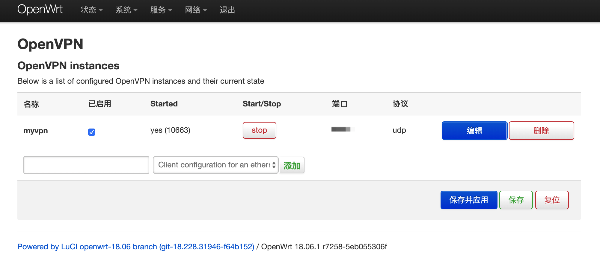

# openvpn 组建家用网络的配置

## 1.基本信息

网络架构：使用一台路由器作为中心服务器节点，将各地的终端客户端连接起来

服务端系统：openwrt 19/21(只在这两个系统上实施过)

客户端系统：windows 10

## 2.服务端配置

参照https://blog.dreamtobe.cn/openwrt_openvpn/ 进行配置，下面进行了个人认为必要的补充。

### 2.1 创建必要的目录和文件

```bash
PKI_DIR="/etc/openvpn/ssl"
mkdir -p ${PKI_DIR}
chmod -R 0600 ${PKI_DIR}
cd ${PKI_DIR}
touch index.txt; echo 1000 > serial
mkdir newcerts
```

### 2.2 生成openvpn配置文件

以/etc/ssl/openssl.cnf为基准文件

```bash
cp /etc/ssl/openssl.cnf ${PKI_DIR}
```

```bash
PKI_CNF=${PKI_DIR}/openssl.cnf

sed -i '/^dir/   s:=.*:= /etc/openvpn/ssl:'                      ${PKI_CNF}
sed -i '/.*Name/ s:= match:= optional:'                    ${PKI_CNF}

sed -i '/organizationName_default/    s:= .*:= WWW Ltd.:'  ${PKI_CNF}
sed -i '/stateOrProvinceName_default/ s:= .*:= London:'    ${PKI_CNF}
sed -i '/countryName_default/         s:= .*:= GB:'        ${PKI_CNF}

sed -i '/default_days/   s:=.*:= 3650:'                    ${PKI_CNF} ## default usu.: -days 365
sed -i '/default_bits/   s:=.*:= 4096:'                    ${PKI_CNF} ## default usu.: -newkey rsa:2048
```

在末尾添加客户端和服务端的注册内容

```ini
###############################################################################
### Check via: openssl x509 -text -noout -in *.crt | grep 509 -A 1
[ my-server ]
#  X509v3 Key Usage:          Digital Signature, Key Encipherment
#  X509v3 Extended Key Usage: TLS Web Server Authentication
  keyUsage = digitalSignature, keyEncipherment
  extendedKeyUsage = serverAuth

[ my-client ]
#  X509v3 Key Usage:          Digital Signature
#  X509v3 Extended Key Usage: TLS Web Client Authentication
  keyUsage = digitalSignature
  extendedKeyUsage = clientAuth
```

---

#### [补充]多个客户端的注册方法

当存在多个客户端时，为表区分，最好设置相关文件的文件名不同。同时，需要在openssl.cnf末尾添加相应的keyUsage和extendedKeyUsage，如：

```ini
[ server ]
  keyUsage = digitalSignature, keyEncipherment
  extendedKeyUsage = serverAuth
  
[ client_1 ]
  keyUsage = digitalSignature
  extendedKeyUsage = clientAuth
  
[ client_2 ]
  keyUsage = digitalSignature
  extendedKeyUsage = clientAuth
```

注意：这里多个客户端的名字不可以重复

---

### 2.3 创建服务端与客户端的文件

服务端文件

```bash
openssl req -batch -nodes -new -keyout "ca.key" -out "ca.crt" -x509 -config ${PKI_CNF}  ## x509 (self-signed) for the CA
openssl req -batch -nodes -new -keyout "my-server.key" -out "my-server.csr" -subj "/CN=my-server" -config ${PKI_CNF}
openssl ca  -batch -keyfile "ca.key" -cert "ca.crt" -in "my-server.csr" -out "my-server.crt" -config ${PKI_CNF} -extensions my-server
```

客户端文件

```ini
openssl req -batch -nodes -new -keyout "my-client.key" -out "my-client.csr" -subj "/CN=my-client" -config ${PKI_CNF}
openssl ca  -batch -keyfile "ca.key" -cert "ca.crt" -in "my-client.csr" -out "my-client.crt" -config ${PKI_CNF} -extensions my-client
```

---

#### [补充]解决证书过期问题（默认30天过期）

将openssl.cnf中default_days 、default_crl_days设为：

```ini
default_days    = 3650
default_crl_days= 3650                  # how long before next CRL
```

在生成.crt证书时，原文没有加有效时间，有效时间默认为30天，如果不想频繁的更换新ca，可以加入-days选项，如：

```bash
openssl req -batch -nodes -new -keyout "ca.key" -out "ca.crt" -x509 -config ${PKI_CNF} -days 3650
openssl req -batch -nodes -new -keyout "my-client.key" -out "my-client.csr" -subj "/CN=my-client" -config ${PKI_CNF} -days 3650
```

所有crt文件，客户端和服务端的都要这样设置，否则一个月到期后证书将过期。使用如下命令查看证书有效期

```bash
openssl x509 -in ca.crt -noout -dates
输出为：
notBefore=Sep 30 09:19:47 2021 GMT
notAfter=Sep 28 09:19:47 2031 GMT #到期时间，查看是否为设置时间
```

---

配置权限

```bash
chmod 0600 "ca.key"
chmod 0600 "my-server.key"
chmod 0600 "my-client.key"
```

生成hellman

```bash
openssl dhparam -out dh2048.pem 2048
```

## 3.修改网络配置

创建网卡

```bash
uci set network.vpn0=interface
uci set network.vpn0.ifname=tap0
uci set network.vpn0.proto=none
uci set network.vpn0.auto=1
```

添加到LAN桥中

```bash
uci set network.lan.ifname="$(uci get network.lan.ifname) tap0"
```

配置权限，以使流量进入，这里可以配置服务端口，这里需要和后面客户端.ovpn文件中的端口相对应

```bash
uci set firewall.Allow_OpenVPN_Inbound=rule
uci set firewall.Allow_OpenVPN_Inbound.target=ACCEPT
uci set firewall.Allow_OpenVPN_Inbound.src=*
uci set firewall.Allow_OpenVPN_Inbound.proto=udp
uci set firewall.Allow_OpenVPN_Inbound.dest_port=1194
```

生效

```bash
uci commit network
/etc/init.d/network reload
uci commit firewall
/etc/init.d/firewall reload
```

## 4.启动服务

将配置文件汇总

```bash
cp /etc/openvpn/ssl/ca.crt /etc/openvpn/ssl/my-server.* /etc/openvpn/ssl/dh2048.pem /etc/openvpn
```

进行服务配置

```bash
echo > /etc/config/openvpn
uci set openvpn.myvpn=openvpn
uci set openvpn.myvpn.enabled=1
uci set openvpn.myvpn.verb=3
uci set openvpn.myvpn.proto=udp
uci set openvpn.myvpn.port=1194
uci set openvpn.myvpn.dev=tap
uci set openvpn.myvpn.mode=server
uci set openvpn.myvpn.tls_server=1
uci add_list openvpn.myvpn.push='route-gateway dhcp'
uci set openvpn.myvpn.keepalive='10 120'
uci set openvpn.myvpn.ca=/etc/openvpn/ca.crt
uci set openvpn.myvpn.cert=/etc/openvpn/my-server.crt
uci set openvpn.myvpn.key=/etc/openvpn/my-server.key
uci set openvpn.myvpn.dh=/etc/openvpn/dh2048.pem
uci commit openvpn
```

配置开机启动和自动重启

```bash
/etc/init.d/openvpn enable
/etc/init.d/openvpn start
```

可以看到服务



## 5.客户端配置

将服务端生成的客户端文件scp出来，共需要三个文件：ca.crt，my-client.crt，my-client.key，名字取决于你生成文件时的设置

新建一个.ovpn文件，并将三个文件中的内容输入进去，ovpn文件的结构如下：

```ini
dev tap #tap或tun模式，tap为桥接入server的子网，tun为另起一个vpn子网
proto udp  

verb 3  

client 
remote-cert-tls server 
remote your-server 1194 #这里填入服务端的ip/域名，以及端口号

<ca>
#ca.crt中的内容
</ca>

<cert>
#my-client.crt中的内容
</cert>

<key>
#my-client.key中的内容
</key>

```

完成后，在openvpn客户端中导入此ovpn文件即可连接
